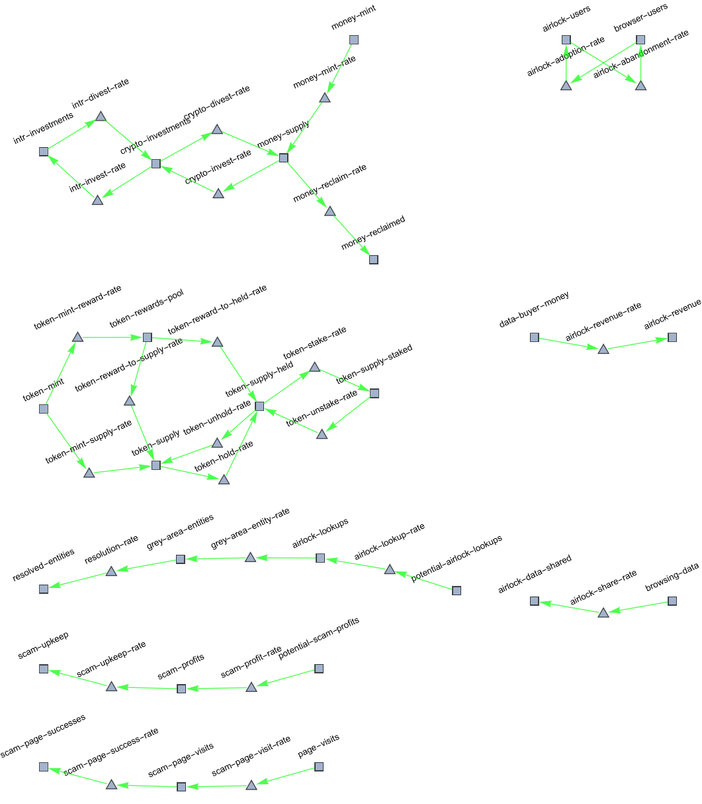
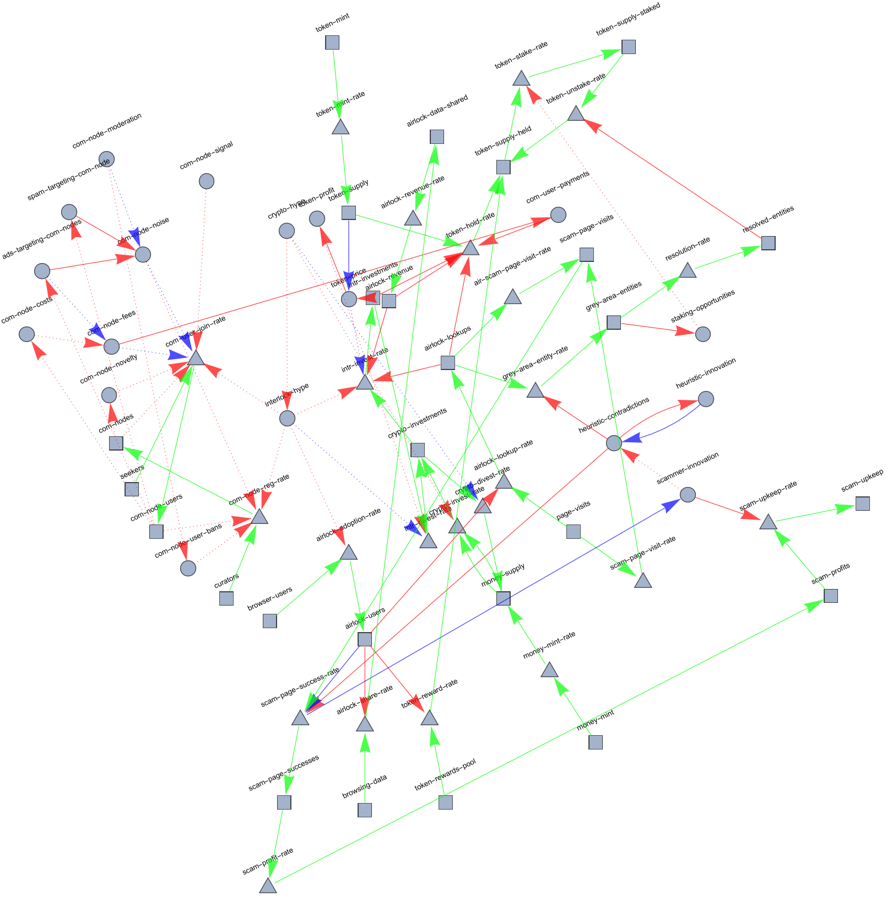

# Purpose

The purpose of this document is to explain the cadCAD model and its operation.
We describe each of the variables (stocks, flows, indicators) and how they
influence each other, as well as _what assumptions are behind each of the
influences_. Furthermore, we conclude each section with _questions_,
that question some aspect of the assumption. Each section begins with
stocks and flows (as they represent contcrete material quantities)
and only then moves on to indicators (which are more abstract).

This document is meant to be concise, and used in conjuction with
(a) the graphs in the repo, (b) the cadCAD model itself, and (c)
a larger, more formal document that is still being written.

# Organization

While all of the variables are enmeshed, we still divide them by their
purpose. We divide them as follows:

  * Airlock Extension
  * Interlock Revenue
  * Token Distribution
  * Investment
  * Security and Staking
  * Scammers

# Reference Graphs

Here is a graph with only the stocks and flows (squares are stocks and
triangles are flows). You can think of the stocks as cisterns, and of the flows
as valves, and of the green arrows as pipes.

And here is the graph that contains all of the interactions between all variables.
Red arrows mean _positive correlation_ and blue arrows mean _negative correlation_.
Dotted arrows imply _delayed effect_.

# Limitations

This is unfinished work, but it is _finished enough_ to inform our general
trajectory. This is essentially a _living model_, and we will keep updating
it and refining it continuously.

# Airlock Extension

## Stocks and Flows

The Airlock Extension has 2 primary stocks and 2 primary flows.

**browser-users:** This stock represents all browser-users on the planet. They
can all potentially become Airlock users.

**airlock-users:** This stock represents browser users that have installed the
Airlock extension. **interactions:** An increase in this stock will increase
the *airlock-share-rate* and *airlock-lookup-rate*, and will _decrease_ the
*scam-page-success-rate*.

**airlock-adoption-rate:** The rate at which the browser users become Airlock users.
**interactions:** See the _Token Distribution_ section for more details.

**airlock-abandonment-rate:** The rate at which the airlock users uninstall the
extension. See the _Security and Staking_ section for more details.

## Indicators

There are no indicators directly related to the extension. But there are indicators
indirectly related in the _Interlock Revenue_, _Token Distribution_, and _Investment_ sections.

# Interlock Revenue

## Stocks and Flows

There are 2 networks of stocks and flows that are relevent to Interlock Revenue.
First is the flow from **data-buyer-money** to **airlock-revenue**, and the second
is the flow from **browsing-date** to **airlock-data-shared**. In short,
the more data is shared (anonymously and with consent), the more data there is to sell,
thus increasing our revenues (and therefore our buybacks).

**airlock-revenue-rate:** represents the rate at which we make money per unit of data.
An increase in this flow would cause an _increase_ in the **token-hold-rate** (due to
buybacks).

## Indicators

The only indicator for Interlock Revenue is the **data-value**. The larger this value is
the more money flows into **airlock-revenue** stock. This variable is exogenous,
where we randomly shock the price according to the prices we have observed from
various data-brokers. (currently, 100 to 600 dollars per thousand units of data -- a unit of data for
us is a URL).

# Token Distribution

## Stocks and Flows

This is one of the more complicated flow-graphs. Essentially, all tokens arrive from the mint,
and circulate between the stocks: **token-supply**, **token-supply-held**, and **token-supply-staked**.
The movement between **token-supply** and **token-supply-held** represents buying and selling activity.
The movement from **token-rewards** to **token-supply** represents the issuing of rewards to our
extension users (and eventually bouncer-bot users).

**token-supply:** this stock is important because it is the primary determiner of the token-price.
It does not _have_ to be this way, but we made it like this for the sake of pessimism. Because
the supply goes up by 4725000 tokens per week (on average), the price is chronically divided by
this ever growing denominator. **question:** should we instead mint the token directly into the
held-pool (i.e. airdrops and reserves), and release it depending on market conditions?

**token-rewards-to-supply-rate:** this is the rate at which tokens move from the rewards-pool into
the supply pool. Half of all rewards tokens move into this pool weekly (the idea being that
half of users will be eager to sell within the week). This has _positive correlation_ with
**airlock-adoption-rate**, the idea being that more users will use the extension the larger the
average-rewards-per-user is. We were initially very conservative and selective with the rewards-pool
making it dependent on the token-price. However, cadCAD simulations revealed that if we distribute the
entire weekly rewards pool every week, the number of users that we gain is proportional to the
average reward per user. This was the original intent of the rewards pool to begin with so it seems
like a good thing. **question:** should we _multiply_ this adoption rate by the **token-price**?
This would have the effect of making adoption-rate proportional to the value of the token. It
makes sense, but one wonders how realistic our simulated-price is to begin with (see next section).

**token-rewards-to-held-rate:** this is like the previous flow, but it assumes that half the users will
not sell their rewards. It has similar effects on adoption. **question:** this question applies to the
previous flow (and the previous question applies to this flow, as well) -- since giving away rewards
increases the incentive for sybil attacks, how can we mitigate/prevent such attacks, and how can
we simulate them in cadCAD (for example, we have have a sybil-efficiency that indicates how skewed
the pareto-distribution of rewards is).

## Indicators

The key indicators that influence token distribution are all located in the _Investment_ section
and the _Security Staking_ section.

# Investment

## Stocks and Flows

Because investment has a lot to do with money, we need to model (very, very approximately) the
supply and flow of money. It turns out that the circulating supply of money is a good indicator
for whether people are willing and able to invest it (or to divest it) in crypto-currencies.

The root stock in this system is the **money-mint**, and and there is a drain called **money-reclaimed**.
Money moves from the **money-mint** to the **money-supply** and into **money-reclaimed**. Whether
money gets minted or reclaimed is subject to economic policy, thankfully we have plenty of data
(going back more than a century) for the growth and contractions of circulating supply.

Generally, most crises are preceded by sharp increases in supply (see the dot-com bust, and the
housing-crisis, and the pandemic), followed by sharp decreases. We are currently seeing a
decrease in circulating as a result of the massive 15% increase in circulating supply we saw since
the 2020 pandemic. The good news is that, the only direction it can go now is up.

At any rate, money in the **money-supply** gets diverted to the **crypto-investments** stock,
and from _there_, it get diverted into the **intr-investments** stock. Naturally, it can
go the other way too. These flows are controlled by the indicators in the next section

## Indicators

**crypto-hype:** this is how enthusiastic people are about crypo. It feeds-forward into
the **interlock-hype** indicator. It is strongly correlated to the growth/contraction
of the **money-supply**.

**money-growth:** is an indicator (exogenous) that controls the growth in the money supply.

# Security and Staking (and Scammers)

## Stocks and Flows

There are 3 flow-sequences that influence each other. Firstly, there is the flow
of **page-visits** to **scam-page-visits** to **scam-page-successes**. Secondly,
there is the flow of **potential-airlock-lookups** to **airlock-lookups** to
**grey-area-entities** to **resolved-entities**. Thirdly, there is the flow of
**potential-scam-profits** to **scam-profits** to **scam-upkeep**. The more
we can push through the the _second flow_ the more we can push **scam-profits** into
**scam-upkeep**, making scams economically unviable. The first flow is very tightly
connected to the _third flow_.

## Indicators

**heuristic-contradictions:** this is a key indicator. The more contradictions there are,
the fewer scams our extension prevents, and the more grey-area-entites we create, thus
creating more staking opportunities. The scammers wish to maximize this variable, while
we wish to minimize it. The scammers only care about maximizign this variable if they see
a significant decrease in profits (we are unlikely to get to this point in the first 50 weeks).
**assumptions:** for legibility we assume that all contradictions get resolved within a single
week. **interactions:** this indicator increases the airlock-abandonment rate (but so far
has been been nullified by the rewards-rate when simulated). **questions:** should we give contradictions
more influence over abandonment, relative to rewards-rate?

**heuristic-innovation:** causes a decrease in **heuristic-contradictions**.

**scammer-innovation:** increases contradictions, but at the cost of diverting scam-profits to
scam-upkeep.

**scam-profits-per-page:** this is how much money scammers make per successful scam. We have
_zero_ data for this. We have estimates of total money made (many **billions** of dollars), but
we do not know how many scam-pages are visited and how many of those succeed. **question:**
how can we improve our estimates or -- failing at that -- what kinds of simulated rates are
most relevant to us?

**staking-enthusiasm:** represents how much people care about earning money via staking.

**staking-opportunities:** directly correlated to **grey-area-entities**. This indicator (along with the previous
one) controls the movement of tokens from **token-supply** to **tokens-held** and from there to **tokens-staked**.
The idea behind staking is that it temporarily reduces the total supply, in exchange for having
to give a yield in the future.

**max-total-stake-per-entity:** we limit how much money can be staked per entity, to prevent
depletion of the staking-rewards-pool (simulated as 1 pool).

# Current cadCAD Problems

We rely heavily on deltas, which is fine for simulating growth, but presents us with dire
situations in the face of stagnation (i.e. if interlock-hype is 100% for 2 turns in a row,
that can result in an investment-rate of _zero_, which is clearly wrong -- why would someone
refuse to invest if they have total confidence in something). We need a way to account
for both relative growth, but also for static absolute values. Another good example is
**heuristic-contradictions**. If it is the same over 2 time-steps, the **heuristic-innovation**
dropped to zero, because the "urgency to innovate" did not grow. We have fixed this, but
we have similar issues with other variables.