# MAD-3: Next Evolution

## Changes Since MAD-2

In the previous Model Analysis Document (MAD-2) we took a look at how
genetic algorithms can be used to efficiently select decision-parameters from
a large solution space. Since then we have made some changes to the evolutionary
parameters, because -- once we fixed the loopholes that the original genetic runs
found -- it became apparent that the fitness and performance of the organisms
declined dramatically.

It turns out that we were not effectively repopulating each generation with offspring.
We would replace 100 parents with 20 offspring (of the top 20% of organisms), instead of
100 offspring (of the top 20% of organisms). We also found that using the token-price
as a fitness variable was only an indicator of fitness while the loopholes existed.
Because price is in large part determined by a statistical procedure, it is largely
stochastic -- we can influence it only if we have the rare combination of enormouse
revenues (which would be used to buyback tokens), and a user base that stakes tokens
in perpetuity (one of the loopholes from MAD-2). Once those conditions are gone,
the price is beyond our control, and we are still testing on the _worst case_, _apocalyptic_
scenario, so we expect the token-price to be disappointing.

Instead of price, we tried a composite value of users, revenue, and price, and that was
also not very effective. For short runs, price is the dominant value, because price is high
in the beginnign, but it drags down our aggregate fitness in long runs (all of these
are equally weighted, btw). However, a fitness value based on revenue alone produced
very good results (revenue is directly correlated to users, and the more of it you have,
the more fit you are). It should be noted that picking strange and nonsensical fitness-values,
might be a good way to discover bugs in the model itself.

In addition to changing the fitness-value, we have changed the stimuli-set by adding
a new stimulus -- the `heuristic-contradictions` value. Previously, contradictions did
not affect the performance of the model, becuase we were busy modelling other things.
But now, we have changed to model actually simulate abandonment rate (in MAD-2 this was not
simulated, in MAD-1 is _was_ as a function of rewards), and we do so by causing a percent-loss
of users based on the contradiction-rate (which roughly corresponds to false-positive-rate).

For example, if we have a contradiction-rate of 20%, every _fifth_ page the user visits
is going to -- annoyingly -- get flagged incorrectly, forcing them to intervene and
get annoyed. In the model, if there is a 20% contradiciton-rate, we lose 20% of users
for in that week. This is catastrophic, so we don't model higher contradiction rates.
In general, if the contradiction rate is between 1% and 5%, only 1% of users get lost.
If between 5% and 10%, only 2%. If between 10% and 15%, only 5%. If between 15% and 20%,
a whopping 10%. The model is not directly stimulated by growth and drop in user-numbers
-- only progress to the user-goal of 100M. So, we made the contradiction rate act as a
direct stimulus (which is also something we can measure more accurately in real life).

We also fixed a problem with negative flows (appeared only once, because the GA did figure
out a way to trigger that phenomenon -- it is still unclear if it led to an increase in fitness
or not).

And we changed the name of all stimuli-state-variables to include the prefix `stim-` so
that we can more easily plot them.

We have also added a `change-urgency` action, which basically burns money to discover a new
heuristic, to lower the `heuristic-contradictions` value (and thus lower our abandonment-rate).
On the topic of actions, we make our interpretation of the action-values an absolute-value
interpretation, because for those action, negative numbers are effectively semantically equivalent
to zero, which confuses the genetic-algorithm.

We also made the genome more granular: instead of `[-1, 0, 1]` as our possible values, we have
`[-1, -0.5, 0, 0.5, 1]`.

## What Evolutions Did We Run?

We ran 2 evolutions: one over 200 weeks, with the worst-case, apocalytpic parameterization,
and one over 20 weeks, with the same parameterization. The latter was more of a
sanity check, but it also tells what the most that we can expect is over 20 weeks
(assuming no enterprise customers, assuming no investment-derived revenue, and assuming
no selling of any of our existing tokens). All of these assumptions will be un-assumed
in future MADs -- in particular, MAD-4 will cover a more accurate modelling of the
various token-pools that we can coded into our smart-contract (with vesting schedules
and vesting cliffs fully modelled), allowing us to sell and buy tokens as (and if) needed.

## First 20 Weeks

Lets start with the 20-week run.

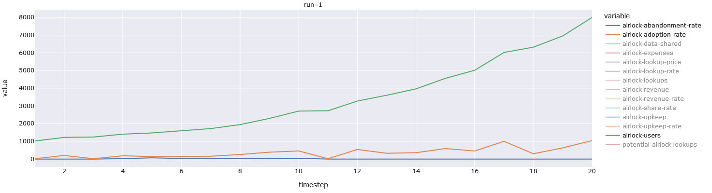

Focusing on users, we see that we grow from 1k users to 8k users over 20 weeks, which
is around the maximum that the model can manage, if we assume a weekly growth rate between 1% and 20%
-- which matches the real world data.

Let's take a look at the adoption rate and abandonment rate.


We can see a general upwards trend in adoption, and only a brief period of abandonment.
Let's take a look at that.

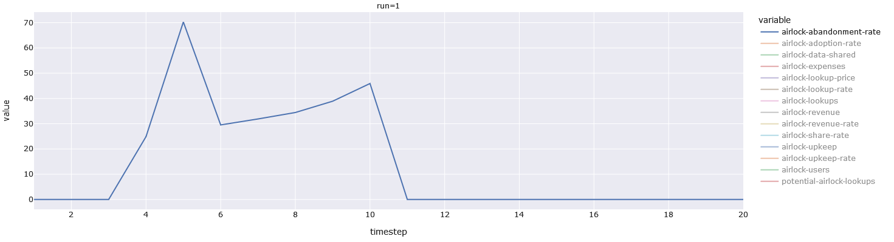

We do have some abandoment, but nothing catastrophic, since the model reacted and decreased the
heuristic contradictions.

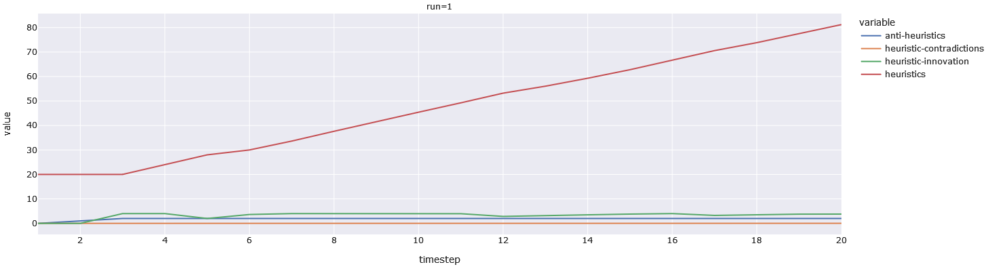

As you can see, the model aggressively adds new heuristics to make the contradiction-rate as
low as possible, as quickly as possible -- which is adaptive in the first 20 weeks (where it
would cost us the most, proportionally).

The reason that the scammers do not innovate further, is that we have too few users. It is
unclear why we see a burst of scammer innovation in the first few weeks (it might have something
to do with the initialization-values for the scam-page stocks and flows).

Speaking of money:

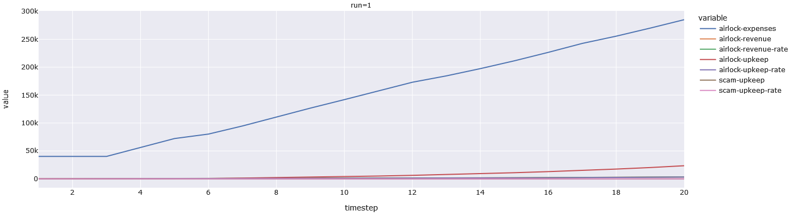

We can see the expenses skyrocket due to the heuristic-innovatin that is taking place
(we assume that each new heuristic costs 1 additional engineer-week -- this is a worst-case
run, after all).

We see upkeep go up along a similar curve, below. Upkeep is the fraction of expenses that
we were able to cover with the existing revenue. Expenses minus upkeep is how much investment-money
we burn. The good news is that even in the worst-case scenario (i.e. where we have extremely low
demand for the data we sell), these numbers are trending upwards. (Also, by the end of the run, we
accumulate 60M reward-tokens, which could easily cover all expenses, so no big deal -- we just have
to add swapping into MAD-4).

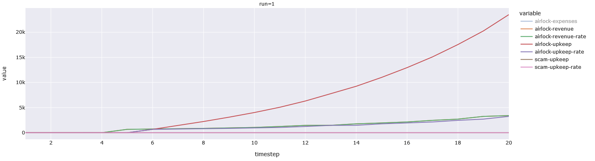

Now we will take a look at the various token-pools. The first 20 weeks see relatively stagnant
pools, which makes sense due to the vesting-rates. The rewards pool is growing steadily. You will
notice that the staking-pool is flat, and that is because staking did not make a noticeable difference
in the fitness. This, in turn, is because it does nothing to impact our revenue. However, in reality,
it would impact our revenue, since it would make the creation and training of new heuristics much easier.
That is something we will add into MAD-4.

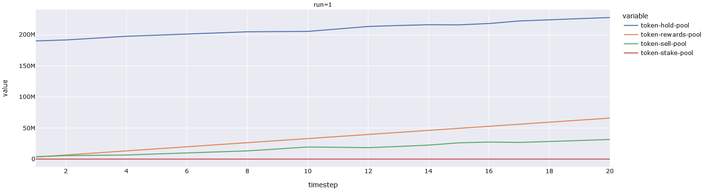

Below, we have the token-price and related variables. As in every run, the token-price opens high, and
trend downwards (which matches real world data, and happens to be good for adoption-rate). There is
nothing eye-popping to see here. But we do want to point out a curiosity. Before we added the
heuristic-contradictions stimulus, the model would interpret token-price fluctuations as a signal
to add more heuristics. Why? Well, if it didn't it would have less users and lower revenue. But,
why token-price? Even though we _do_ have a clock, it does _not_ act as a stimulus. However, since
price-fluctuations are _periodic_ the model was able to use those as a way keep time! Perhaps
we should make the clock a stimulus?

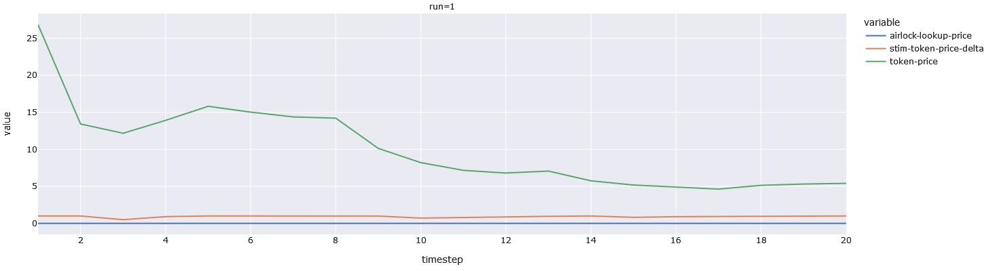

## Top Organisms for 20W Run

Here are the top organisms for the 20W run. You will notice that all of them have at least
one stimulus that triggers their `urgency` action, which results in heuristic innovation.
You will also notice that these top-performers have lots of zero-stimuli. It is unclear why,
but the organisms seem to trend towards zero generation-after-generation. The deletion-rate
might be too high, but who knows. The nice thing about this, is that we can see which stimuli
are not _strictly_ necessary.

```
[({'stim-contradiction-rate-change-max-stake': 0,
   'stim-anti-user-goal-progress-change-max-stake': 0,
   'stim-user-goal-progress-change-max-stake': 0,
   'stim-token-price-delta-change-max-stake': 0,
   'stim-contradiction-rate-change-stake-yield': 0,
   'stim-anti-user-goal-progress-change-stake-yield': 0,
   'stim-user-goal-progress-change-stake-yield': 0,
   'stim-token-price-delta-change-stake-yield': 0,
   'stim-contradiction-rate-change-lookup-fee': 0,
   'stim-anti-user-goal-progress-change-lookup-fee': 0,
   'stim-user-goal-progress-change-lookup-fee': 0.5,
   'stim-token-price-delta-change-lookup-fee': 0,
   'stim-contradiction-rate-change-user-fee': 0,
   'stim-anti-user-goal-progress-change-user-fee': 0,
   'stim-user-goal-progress-change-user-fee': 0,
   'stim-token-price-delta-change-user-fee': 0,
   'stim-contradiction-rate-change-buyback-amount': 0,
   'stim-anti-user-goal-progress-change-buyback-amount': 0,
   'stim-user-goal-progress-change-buyback-amount': 0,
   'stim-token-price-delta-change-buyback-amount': 0,
   'stim-contradiction-rate-change-reward-amount': 0,
   'stim-anti-user-goal-progress-change-reward-amount': 0,
   'stim-user-goal-progress-change-reward-amount': 0.5,
   'stim-token-price-delta-change-reward-amount': 0,
   'stim-contradiction-rate-change-urgency': 0,
   'stim-anti-user-goal-progress-change-urgency': 0,
   'stim-user-goal-progress-change-urgency': 0,
   'stim-token-price-delta-change-urgency': 1},
  0.0002102178086356229),
 ({'stim-contradiction-rate-change-max-stake': 0,
   'stim-anti-user-goal-progress-change-max-stake': -1,
   'stim-user-goal-progress-change-max-stake': 0,
   'stim-token-price-delta-change-max-stake': 0,
   'stim-contradiction-rate-change-stake-yield': -0.5,
   'stim-anti-user-goal-progress-change-stake-yield': 0,
   'stim-user-goal-progress-change-stake-yield': 0.5,
   'stim-token-price-delta-change-stake-yield': 0,
   'stim-contradiction-rate-change-lookup-fee': -0.5,
   'stim-anti-user-goal-progress-change-lookup-fee': 0,
   'stim-user-goal-progress-change-lookup-fee': 0.5,
   'stim-token-price-delta-change-lookup-fee': 0,
   'stim-contradiction-rate-change-user-fee': -0.5,
   'stim-anti-user-goal-progress-change-user-fee': 0,
   'stim-user-goal-progress-change-user-fee': 0,
   'stim-token-price-delta-change-user-fee': 0,
   'stim-contradiction-rate-change-buyback-amount': 0,
   'stim-anti-user-goal-progress-change-buyback-amount': 0,
   'stim-user-goal-progress-change-buyback-amount': 0,
   'stim-token-price-delta-change-buyback-amount': 0,
   'stim-contradiction-rate-change-reward-amount': -1,
   'stim-anti-user-goal-progress-change-reward-amount': 0,
   'stim-user-goal-progress-change-reward-amount': 0.5,
   'stim-token-price-delta-change-reward-amount': 0,
   'stim-contradiction-rate-change-urgency': 0,
   'stim-anti-user-goal-progress-change-urgency': 0,
   'stim-user-goal-progress-change-urgency': 1,
   'stim-token-price-delta-change-urgency': 1},
  0.00021037610146845066),
 ({'stim-contradiction-rate-change-max-stake': 0,
   'stim-anti-user-goal-progress-change-max-stake': -1,
   'stim-user-goal-progress-change-max-stake': 0,
   'stim-token-price-delta-change-max-stake': 0,
   'stim-contradiction-rate-change-stake-yield': 0,
   'stim-anti-user-goal-progress-change-stake-yield': 0,
   'stim-user-goal-progress-change-stake-yield': 0,
   'stim-token-price-delta-change-stake-yield': 0,
   'stim-contradiction-rate-change-lookup-fee': -0.5,
   'stim-anti-user-goal-progress-change-lookup-fee': 0,
   'stim-user-goal-progress-change-lookup-fee': 0.5,
   'stim-token-price-delta-change-lookup-fee': 0,
   'stim-contradiction-rate-change-user-fee': -0.5,
   'stim-anti-user-goal-progress-change-user-fee': 0,
   'stim-user-goal-progress-change-user-fee': 0,
   'stim-token-price-delta-change-user-fee': -1,
   'stim-contradiction-rate-change-buyback-amount': 0,
   'stim-anti-user-goal-progress-change-buyback-amount': 0,
   'stim-user-goal-progress-change-buyback-amount': 0,
   'stim-token-price-delta-change-buyback-amount': 0,
   'stim-contradiction-rate-change-reward-amount': -1,
   'stim-anti-user-goal-progress-change-reward-amount': 0,
   'stim-user-goal-progress-change-reward-amount': 0.5,
   'stim-token-price-delta-change-reward-amount': -1,
   'stim-contradiction-rate-change-urgency': 0,
   'stim-anti-user-goal-progress-change-urgency': 0,
   'stim-user-goal-progress-change-urgency': 1,
   'stim-token-price-delta-change-urgency': 1},
  0.00021702180622473259),
 ({'stim-contradiction-rate-change-max-stake': 1,
   'stim-anti-user-goal-progress-change-max-stake': 0,
   'stim-user-goal-progress-change-max-stake': 0,
   'stim-token-price-delta-change-max-stake': 0,
   'stim-contradiction-rate-change-stake-yield': -0.5,
   'stim-anti-user-goal-progress-change-stake-yield': 0,
   'stim-user-goal-progress-change-stake-yield': 0,
   'stim-token-price-delta-change-stake-yield': 0,
   'stim-contradiction-rate-change-lookup-fee': 0,
   'stim-anti-user-goal-progress-change-lookup-fee': 0,
   'stim-user-goal-progress-change-lookup-fee': 0.5,
   'stim-token-price-delta-change-lookup-fee': 0,
   'stim-contradiction-rate-change-user-fee': 0,
   'stim-anti-user-goal-progress-change-user-fee': 0,
   'stim-user-goal-progress-change-user-fee': 0,
   'stim-token-price-delta-change-user-fee': 0,
   'stim-contradiction-rate-change-buyback-amount': 0,
   'stim-anti-user-goal-progress-change-buyback-amount': 0,
   'stim-user-goal-progress-change-buyback-amount': 0,
   'stim-token-price-delta-change-buyback-amount': 0,
   'stim-contradiction-rate-change-reward-amount': -1,
   'stim-anti-user-goal-progress-change-reward-amount': 0,
   'stim-user-goal-progress-change-reward-amount': 0.5,
   'stim-token-price-delta-change-reward-amount': 0,
   'stim-contradiction-rate-change-urgency': 0,
   'stim-anti-user-goal-progress-change-urgency': 0.5,
   'stim-user-goal-progress-change-urgency': 0,
   'stim-token-price-delta-change-urgency': 1},
  0.0002170284121005363),
 ({'stim-contradiction-rate-change-max-stake': 0,
   'stim-anti-user-goal-progress-change-max-stake': 0,
   'stim-user-goal-progress-change-max-stake': 0,
   'stim-token-price-delta-change-max-stake': 0,
   'stim-contradiction-rate-change-stake-yield': 0,
   'stim-anti-user-goal-progress-change-stake-yield': 0,
   'stim-user-goal-progress-change-stake-yield': 0,
   'stim-token-price-delta-change-stake-yield': 0,
   'stim-contradiction-rate-change-lookup-fee': 0,
   'stim-anti-user-goal-progress-change-lookup-fee': 0,
   'stim-user-goal-progress-change-lookup-fee': 0.5,
   'stim-token-price-delta-change-lookup-fee': 0,
   'stim-contradiction-rate-change-user-fee': 0,
   'stim-anti-user-goal-progress-change-user-fee': 0,
   'stim-user-goal-progress-change-user-fee': 0,
   'stim-token-price-delta-change-user-fee': 0,
   'stim-contradiction-rate-change-buyback-amount': 0,
   'stim-anti-user-goal-progress-change-buyback-amount': 0,
   'stim-user-goal-progress-change-buyback-amount': 0,
   'stim-token-price-delta-change-buyback-amount': 0,
   'stim-contradiction-rate-change-reward-amount': 0,
   'stim-anti-user-goal-progress-change-reward-amount': 0,
   'stim-user-goal-progress-change-reward-amount': 0.5,
   'stim-token-price-delta-change-reward-amount': 0,
   'stim-contradiction-rate-change-urgency': 0,
   'stim-anti-user-goal-progress-change-urgency': 0,
   'stim-user-goal-progress-change-urgency': 0,
   'stim-token-price-delta-change-urgency': 1},
  0.00021757111286434423),
 ({'stim-contradiction-rate-change-max-stake': 0,
   'stim-anti-user-goal-progress-change-max-stake': 0,
   'stim-user-goal-progress-change-max-stake': 0,
   'stim-token-price-delta-change-max-stake': 0,
   'stim-contradiction-rate-change-stake-yield': 0,
   'stim-anti-user-goal-progress-change-stake-yield': 0,
   'stim-user-goal-progress-change-stake-yield': 0,
   'stim-token-price-delta-change-stake-yield': 0,
   'stim-contradiction-rate-change-lookup-fee': 0,
   'stim-anti-user-goal-progress-change-lookup-fee': 0,
   'stim-user-goal-progress-change-lookup-fee': 0.5,
   'stim-token-price-delta-change-lookup-fee': 0,
   'stim-contradiction-rate-change-user-fee': 0,
   'stim-anti-user-goal-progress-change-user-fee': 0,
   'stim-user-goal-progress-change-user-fee': 0,
   'stim-token-price-delta-change-user-fee': 0,
   'stim-contradiction-rate-change-buyback-amount': 0,
   'stim-anti-user-goal-progress-change-buyback-amount': 0,
   'stim-user-goal-progress-change-buyback-amount': 0,
   'stim-token-price-delta-change-buyback-amount': 0,
   'stim-contradiction-rate-change-reward-amount': 0,
   'stim-anti-user-goal-progress-change-reward-amount': 0,
   'stim-user-goal-progress-change-reward-amount': 0.5,
   'stim-token-price-delta-change-reward-amount': 0,
   'stim-contradiction-rate-change-urgency': 0,
   'stim-anti-user-goal-progress-change-urgency': 0,
   'stim-user-goal-progress-change-urgency': 0,
   'stim-token-price-delta-change-urgency': 1},
  0.00021853085832261216),
 ({'stim-contradiction-rate-change-max-stake': 0,
   'stim-anti-user-goal-progress-change-max-stake': 0,
   'stim-user-goal-progress-change-max-stake': 0,
   'stim-token-price-delta-change-max-stake': 0,
   'stim-contradiction-rate-change-stake-yield': 0,
   'stim-anti-user-goal-progress-change-stake-yield': 0,
   'stim-user-goal-progress-change-stake-yield': 0,
   'stim-token-price-delta-change-stake-yield': 0,
   'stim-contradiction-rate-change-lookup-fee': 0,
   'stim-anti-user-goal-progress-change-lookup-fee': 0,
   'stim-user-goal-progress-change-lookup-fee': 0.5,
   'stim-token-price-delta-change-lookup-fee': 0,
   'stim-contradiction-rate-change-user-fee': 0,
   'stim-anti-user-goal-progress-change-user-fee': 0,
   'stim-user-goal-progress-change-user-fee': 0,
   'stim-token-price-delta-change-user-fee': 0,
   'stim-contradiction-rate-change-buyback-amount': 0,
   'stim-anti-user-goal-progress-change-buyback-amount': 0,
   'stim-user-goal-progress-change-buyback-amount': 0,
   'stim-token-price-delta-change-buyback-amount': 0,
   'stim-contradiction-rate-change-reward-amount': 0,
   'stim-anti-user-goal-progress-change-reward-amount': 0,
   'stim-user-goal-progress-change-reward-amount': 0.5,
   'stim-token-price-delta-change-reward-amount': 0,
   'stim-contradiction-rate-change-urgency': 0,
   'stim-anti-user-goal-progress-change-urgency': 0,
   'stim-user-goal-progress-change-urgency': 0,
   'stim-token-price-delta-change-urgency': 1},
  0.00021920446885038505),
 ({'stim-contradiction-rate-change-max-stake': 0,
   'stim-anti-user-goal-progress-change-max-stake': 0,
   'stim-user-goal-progress-change-max-stake': 0,
   'stim-token-price-delta-change-max-stake': 0,
   'stim-contradiction-rate-change-stake-yield': 0,
   'stim-anti-user-goal-progress-change-stake-yield': 0,
   'stim-user-goal-progress-change-stake-yield': 0,
   'stim-token-price-delta-change-stake-yield': 0,
   'stim-contradiction-rate-change-lookup-fee': 0,
   'stim-anti-user-goal-progress-change-lookup-fee': 0,
   'stim-user-goal-progress-change-lookup-fee': 0.5,
   'stim-token-price-delta-change-lookup-fee': 0,
   'stim-contradiction-rate-change-user-fee': 0,
   'stim-anti-user-goal-progress-change-user-fee': 0,
   'stim-user-goal-progress-change-user-fee': 0,
   'stim-token-price-delta-change-user-fee': 0,
   'stim-contradiction-rate-change-buyback-amount': 0,
   'stim-anti-user-goal-progress-change-buyback-amount': 0,
   'stim-user-goal-progress-change-buyback-amount': 0,
   'stim-token-price-delta-change-buyback-amount': 0,
   'stim-contradiction-rate-change-reward-amount': 0,
   'stim-anti-user-goal-progress-change-reward-amount': 0,
   'stim-user-goal-progress-change-reward-amount': 0.5,
   'stim-token-price-delta-change-reward-amount': 0,
   'stim-contradiction-rate-change-urgency': 0,
   'stim-anti-user-goal-progress-change-urgency': 0,
   'stim-user-goal-progress-change-urgency': 0,
   'stim-token-price-delta-change-urgency': 1},
  0.00021928404676875582)]
```

## Fitness Timeline for 20W Run

Here is a timeline of the top fitness for each generation:

```
[0.0003115097441217225,
 0.00027094132851676064,
 0.0002973981102846095,
 0.00029545164458581193,
 0.0002716591386970342,
 0.0002719945259840177,
 0.0002722261243274479,
 0.00026199020638784315,
 0.00022786211928638362,
 0.00023971123823964585,
 0.0002506844692946208,
 0.0002496199067438085,
 0.00022857396229971144,
 0.00023913526812413148,
 0.0002718945109102462,
 0.00027328352194298827,
 0.00024922268346667833,
 0.00025125135801260873,
 0.00025916198647315126,
 0.000257793424030328,
 0.00022720765491869598,
 0.0002618066674808713,
 0.000284317959632601,
 0.00026100016508634786,
 0.00021702180622473259,
 0.00021037610146845066,
 0.0002814770763374781,
 0.0002837704301502392,
 0.00023926225685520699,
 0.00023788639309150401,
 0.00022797420571234785,
 0.00022784866965649581,
 0.00026009011407480596,
 0.00027211547124409867,
 0.0002482475979748689,
 0.0002170284121005363,
 0.00024822920085128286,
 0.0002708140126833253,
 0.0002604500120412412]
```

We can see that the fitness seems to move between 0.0002 and 0.00028. If we did
not have randomness -- namely, the price-movements (which are determined by markov-chains and order-books)
and the adoption-rate (which is determined by a probability distribution, and can be nudged upwards by
our reward-rate) -- the fitness would move smoothely towards zero (lower is better).

The seed for the RNG does **not** get reset between runs. It is easy to do, but if we did
we would get results that are over-fitted to a specific seed.

## First 200 Weeks

Now we move onto a time-period that is 10x longer, at 200 weeks.

Here we see that the model has learned how to maintain user-growth, and it reliably reaches the
100M user ceiling (we should probably make the ceiling lower for the worst-case... but this
isn't Dark Souls). 

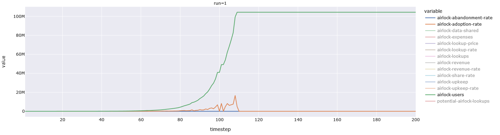

As expected adoption grows multiplicatively.

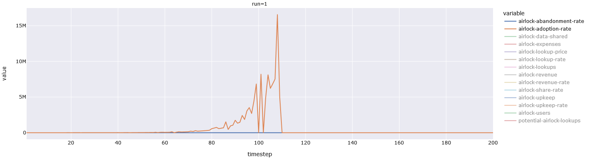

Abandonment is nipped in the bud, as before.

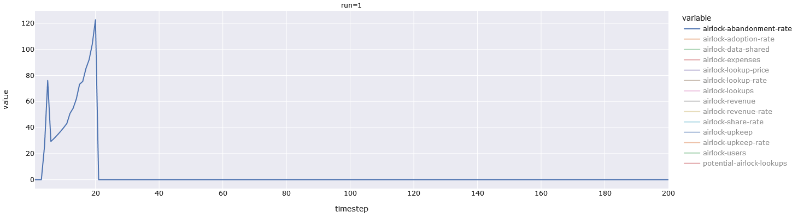

We can see that the model fanatically pursues heuristics, as before.
We have an arbitrary ceiling set at 100. We should either raise the ceiling,
or make the model stop when the ceiling is hit.

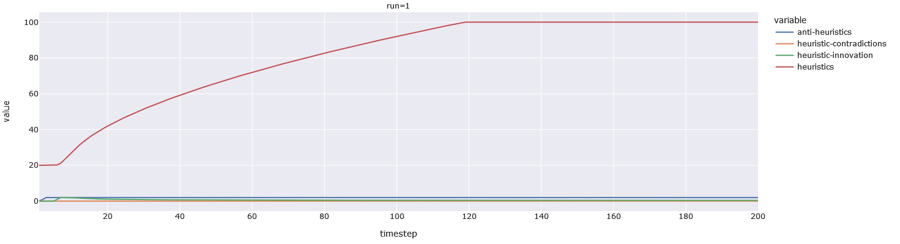

We see that the expenses keep rising, mostly becuase we keep making new heuristics,
even though we do not have to.

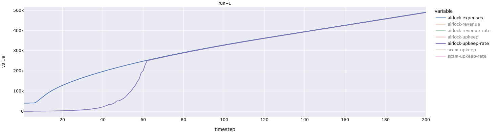

The above heuristic-fanaticism driven expenses result in a total upkeep of over
50M for 200 weeks. Which comes out to an operating budget of 13M per year. Clearly,
we could've stopped spending much earlier (around 120 weeks). Making our real-life
expenses around 20M, or 5.25M per year.

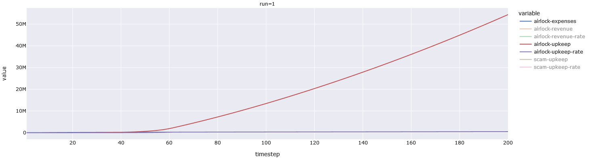

The model is still not a fan of staking, for the aforementioned reasons, and it
is miserly with the rewards, once the threat of heuristic contradictions is neutralized.

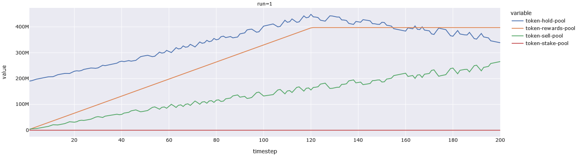

Token-price does go down -- as usual -- but it seems stable. It is no doubt held up
by the lookup-fee of user fee of 5 tokens. In this worst-case scenario, 90% of our
users are free-loaders, meaning that they turn off their data-sharing if the lookup-prices
are above zero. However, that means that 10M people are still paying their dues in ILOCK,
pushing that price up. It also means, that we see a 90% decline in share-rate, but that
is not enough to sink us, because the _adoption_ is still increasing.

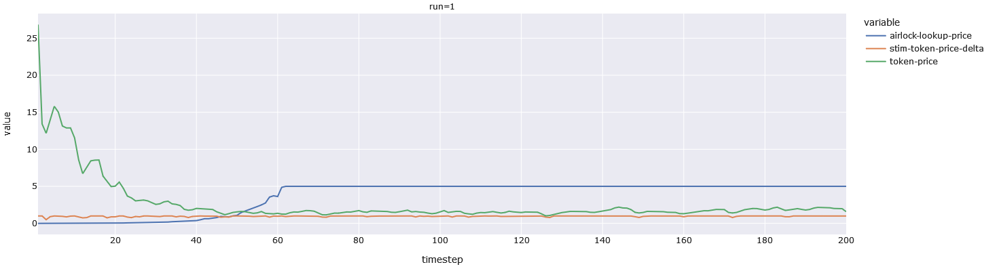

Finally a revenue-plot. Clearly revenues -- even in the worst-case scenario -- end up
dwarfing all upkeep and expenses. This is in _large_ part due to scammers _not noticing_
(they need to see a 10% drop in scam-success-rate, which would require more than 100M
users -- quite possibly a billion or two).

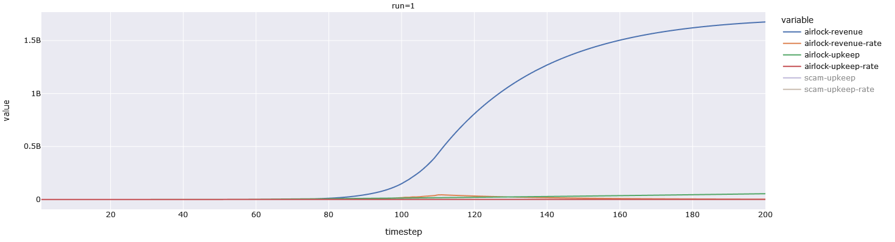

## Top Organisms for 200W Run

As before, these organisms are compulsively urgent (need a better name for this),
and the top one increases the reward-amount in the face of contradictions (we use
an absolute value interpretation so -0.5 is equivalent to 0.5), to _offset_ the abandoment.

```
[({'stim-contradiction-rate-change-max-stake': 0,
   'stim-anti-user-goal-progress-change-max-stake': 0,
   'stim-user-goal-progress-change-max-stake': 0,
   'stim-token-price-delta-change-max-stake': 0,
   'stim-contradiction-rate-change-stake-yield': 0,
   'stim-anti-user-goal-progress-change-stake-yield': 0,
   'stim-user-goal-progress-change-stake-yield': 0,
   'stim-token-price-delta-change-stake-yield': 0,
   'stim-contradiction-rate-change-lookup-fee': 0,
   'stim-anti-user-goal-progress-change-lookup-fee': 0,
   'stim-user-goal-progress-change-lookup-fee': 0,
   'stim-token-price-delta-change-lookup-fee': 0.5,
   'stim-contradiction-rate-change-user-fee': 0,
   'stim-anti-user-goal-progress-change-user-fee': 0,
   'stim-user-goal-progress-change-user-fee': 0,
   'stim-token-price-delta-change-user-fee': 0,
   'stim-contradiction-rate-change-buyback-amount': 0,
   'stim-anti-user-goal-progress-change-buyback-amount': 0,
   'stim-user-goal-progress-change-buyback-amount': 0,
   'stim-token-price-delta-change-buyback-amount': 0,
   'stim-contradiction-rate-change-reward-amount': -0.5,
   'stim-anti-user-goal-progress-change-reward-amount': 0,
   'stim-user-goal-progress-change-reward-amount': 0,
   'stim-token-price-delta-change-reward-amount': 0,
   'stim-contradiction-rate-change-urgency': 1,
   'stim-anti-user-goal-progress-change-urgency': 0,
   'stim-user-goal-progress-change-urgency': 0,
   'stim-token-price-delta-change-urgency': -1},
  5.864029404621362e-10),
 ({'stim-contradiction-rate-change-max-stake': 0,
   'stim-anti-user-goal-progress-change-max-stake': 0.5,
   'stim-user-goal-progress-change-max-stake': 0,
   'stim-token-price-delta-change-max-stake': 0,
   'stim-contradiction-rate-change-stake-yield': 0,
   'stim-anti-user-goal-progress-change-stake-yield': 0,
   'stim-user-goal-progress-change-stake-yield': 0,
   'stim-token-price-delta-change-stake-yield': 0,
   'stim-contradiction-rate-change-lookup-fee': 0,
   'stim-anti-user-goal-progress-change-lookup-fee': 0,
   'stim-user-goal-progress-change-lookup-fee': 0,
   'stim-token-price-delta-change-lookup-fee': 0.5,
   'stim-contradiction-rate-change-user-fee': 0,
   'stim-anti-user-goal-progress-change-user-fee': 0,
   'stim-user-goal-progress-change-user-fee': 0,
   'stim-token-price-delta-change-user-fee': 0,
   'stim-contradiction-rate-change-buyback-amount': 0,
   'stim-anti-user-goal-progress-change-buyback-amount': 0,
   'stim-user-goal-progress-change-buyback-amount': 0,
   'stim-token-price-delta-change-buyback-amount': 0,
   'stim-contradiction-rate-change-reward-amount': -0.5,
   'stim-anti-user-goal-progress-change-reward-amount': 0,
   'stim-user-goal-progress-change-reward-amount': 0,
   'stim-token-price-delta-change-reward-amount': 0,
   'stim-contradiction-rate-change-urgency': 1,
   'stim-anti-user-goal-progress-change-urgency': 0,
   'stim-user-goal-progress-change-urgency': 0,
   'stim-token-price-delta-change-urgency': -1},
  5.864991557427428e-10),
 ({'stim-contradiction-rate-change-max-stake': 0,
   'stim-anti-user-goal-progress-change-max-stake': 0,
   'stim-user-goal-progress-change-max-stake': 0,
   'stim-token-price-delta-change-max-stake': 0,
   'stim-contradiction-rate-change-stake-yield': 0,
   'stim-anti-user-goal-progress-change-stake-yield': 0,
   'stim-user-goal-progress-change-stake-yield': 0,
   'stim-token-price-delta-change-stake-yield': 0,
   'stim-contradiction-rate-change-lookup-fee': 0,
   'stim-anti-user-goal-progress-change-lookup-fee': 0,
   'stim-user-goal-progress-change-lookup-fee': 0,
   'stim-token-price-delta-change-lookup-fee': 0.5,
   'stim-contradiction-rate-change-user-fee': 0,
   'stim-anti-user-goal-progress-change-user-fee': 0,
   'stim-user-goal-progress-change-user-fee': 0,
   'stim-token-price-delta-change-user-fee': 0,
   'stim-contradiction-rate-change-buyback-amount': 0,
   'stim-anti-user-goal-progress-change-buyback-amount': 0,
   'stim-user-goal-progress-change-buyback-amount': 0,
   'stim-token-price-delta-change-buyback-amount': 0,
   'stim-contradiction-rate-change-reward-amount': 0,
   'stim-anti-user-goal-progress-change-reward-amount': 0,
   'stim-user-goal-progress-change-reward-amount': 0,
   'stim-token-price-delta-change-reward-amount': 0,
   'stim-contradiction-rate-change-urgency': 1,
   'stim-anti-user-goal-progress-change-urgency': 0,
   'stim-user-goal-progress-change-urgency': 0,
   'stim-token-price-delta-change-urgency': 0},
  5.865298331139176e-10),
 ({'stim-contradiction-rate-change-max-stake': 0,
   'stim-anti-user-goal-progress-change-max-stake': 0,
   'stim-user-goal-progress-change-max-stake': 0,
   'stim-token-price-delta-change-max-stake': 0,
   'stim-contradiction-rate-change-stake-yield': 0,
   'stim-anti-user-goal-progress-change-stake-yield': 0,
   'stim-user-goal-progress-change-stake-yield': 0,
   'stim-token-price-delta-change-stake-yield': 0,
   'stim-contradiction-rate-change-lookup-fee': 0,
   'stim-anti-user-goal-progress-change-lookup-fee': 0,
   'stim-user-goal-progress-change-lookup-fee': 0,
   'stim-token-price-delta-change-lookup-fee': 0.5,
   'stim-contradiction-rate-change-user-fee': 0,
   'stim-anti-user-goal-progress-change-user-fee': 0,
   'stim-user-goal-progress-change-user-fee': 0,
   'stim-token-price-delta-change-user-fee': 0,
   'stim-contradiction-rate-change-buyback-amount': 0,
   'stim-anti-user-goal-progress-change-buyback-amount': 0,
   'stim-user-goal-progress-change-buyback-amount': 0,
   'stim-token-price-delta-change-buyback-amount': 0,
   'stim-contradiction-rate-change-reward-amount': -0.5,
   'stim-anti-user-goal-progress-change-reward-amount': 0,
   'stim-user-goal-progress-change-reward-amount': 0,
   'stim-token-price-delta-change-reward-amount': 0,
   'stim-contradiction-rate-change-urgency': 1,
   'stim-anti-user-goal-progress-change-urgency': 0,
   'stim-user-goal-progress-change-urgency': 0,
   'stim-token-price-delta-change-urgency': -1},
  5.865975490468823e-10),
 ({'stim-contradiction-rate-change-max-stake': 0,
   'stim-anti-user-goal-progress-change-max-stake': 0,
   'stim-user-goal-progress-change-max-stake': 0,
   'stim-token-price-delta-change-max-stake': 0,
   'stim-contradiction-rate-change-stake-yield': 0,
   'stim-anti-user-goal-progress-change-stake-yield': 0,
   'stim-user-goal-progress-change-stake-yield': 0,
   'stim-token-price-delta-change-stake-yield': 0,
   'stim-contradiction-rate-change-lookup-fee': 0,
   'stim-anti-user-goal-progress-change-lookup-fee': 0,
   'stim-user-goal-progress-change-lookup-fee': 0,
   'stim-token-price-delta-change-lookup-fee': 0.5,
   'stim-contradiction-rate-change-user-fee': 0,
   'stim-anti-user-goal-progress-change-user-fee': 0,
   'stim-user-goal-progress-change-user-fee': 0,
   'stim-token-price-delta-change-user-fee': 0,
   'stim-contradiction-rate-change-buyback-amount': 0,
   'stim-anti-user-goal-progress-change-buyback-amount': 0,
   'stim-user-goal-progress-change-buyback-amount': 0,
   'stim-token-price-delta-change-buyback-amount': 0,
   'stim-contradiction-rate-change-reward-amount': -0.5,
   'stim-anti-user-goal-progress-change-reward-amount': 0,
   'stim-user-goal-progress-change-reward-amount': 0,
   'stim-token-price-delta-change-reward-amount': 0,
   'stim-contradiction-rate-change-urgency': 1,
   'stim-anti-user-goal-progress-change-urgency': 0,
   'stim-user-goal-progress-change-urgency': 0,
   'stim-token-price-delta-change-urgency': -1},
  5.869114466952214e-10),
 ({'stim-contradiction-rate-change-max-stake': 0,
   'stim-anti-user-goal-progress-change-max-stake': 0,
   'stim-user-goal-progress-change-max-stake': 0,
   'stim-token-price-delta-change-max-stake': 0,
   'stim-contradiction-rate-change-stake-yield': 0,
   'stim-anti-user-goal-progress-change-stake-yield': 0,
   'stim-user-goal-progress-change-stake-yield': 0,
   'stim-token-price-delta-change-stake-yield': 0,
   'stim-contradiction-rate-change-lookup-fee': 0,
   'stim-anti-user-goal-progress-change-lookup-fee': 0,
   'stim-user-goal-progress-change-lookup-fee': 0,
   'stim-token-price-delta-change-lookup-fee': 0.5,
   'stim-contradiction-rate-change-user-fee': 0,
   'stim-anti-user-goal-progress-change-user-fee': 0,
   'stim-user-goal-progress-change-user-fee': 0,
   'stim-token-price-delta-change-user-fee': 0,
   'stim-contradiction-rate-change-buyback-amount': 0,
   'stim-anti-user-goal-progress-change-buyback-amount': 0,
   'stim-user-goal-progress-change-buyback-amount': 0,
   'stim-token-price-delta-change-buyback-amount': 0,
   'stim-contradiction-rate-change-reward-amount': 0,
   'stim-anti-user-goal-progress-change-reward-amount': 0,
   'stim-user-goal-progress-change-reward-amount': 0,
   'stim-token-price-delta-change-reward-amount': 0,
   'stim-contradiction-rate-change-urgency': 1,
   'stim-anti-user-goal-progress-change-urgency': 0,
   'stim-user-goal-progress-change-urgency': 0,
   'stim-token-price-delta-change-urgency': 0},
  5.871274292492194e-10),
 ({'stim-contradiction-rate-change-max-stake': 0,
   'stim-anti-user-goal-progress-change-max-stake': 0,
   'stim-user-goal-progress-change-max-stake': 0,
   'stim-token-price-delta-change-max-stake': 0,
   'stim-contradiction-rate-change-stake-yield': 0,
   'stim-anti-user-goal-progress-change-stake-yield': 0,
   'stim-user-goal-progress-change-stake-yield': 0,
   'stim-token-price-delta-change-stake-yield': 0,
   'stim-contradiction-rate-change-lookup-fee': 0,
   'stim-anti-user-goal-progress-change-lookup-fee': 0,
   'stim-user-goal-progress-change-lookup-fee': 0,
   'stim-token-price-delta-change-lookup-fee': 0.5,
   'stim-contradiction-rate-change-user-fee': 0,
   'stim-anti-user-goal-progress-change-user-fee': 0,
   'stim-user-goal-progress-change-user-fee': 0,
   'stim-token-price-delta-change-user-fee': 0,
   'stim-contradiction-rate-change-buyback-amount': 0,
   'stim-anti-user-goal-progress-change-buyback-amount': 0,
   'stim-user-goal-progress-change-buyback-amount': 0,
   'stim-token-price-delta-change-buyback-amount': 0,
   'stim-contradiction-rate-change-reward-amount': 0,
   'stim-anti-user-goal-progress-change-reward-amount': 0,
   'stim-user-goal-progress-change-reward-amount': 0,
   'stim-token-price-delta-change-reward-amount': 0,
   'stim-contradiction-rate-change-urgency': 1,
   'stim-anti-user-goal-progress-change-urgency': 0,
   'stim-user-goal-progress-change-urgency': 0,
   'stim-token-price-delta-change-urgency': 0},
  5.871327134806911e-10),
 ({'stim-contradiction-rate-change-max-stake': 0,
   'stim-anti-user-goal-progress-change-max-stake': 0,
   'stim-user-goal-progress-change-max-stake': 0,
   'stim-token-price-delta-change-max-stake': 0,
   'stim-contradiction-rate-change-stake-yield': 0,
   'stim-anti-user-goal-progress-change-stake-yield': 0,
   'stim-user-goal-progress-change-stake-yield': 0,
   'stim-token-price-delta-change-stake-yield': 0,
   'stim-contradiction-rate-change-lookup-fee': 0,
   'stim-anti-user-goal-progress-change-lookup-fee': 0,
   'stim-user-goal-progress-change-lookup-fee': 0,
   'stim-token-price-delta-change-lookup-fee': 0.5,
   'stim-contradiction-rate-change-user-fee': 0,
   'stim-anti-user-goal-progress-change-user-fee': 0,
   'stim-user-goal-progress-change-user-fee': 0,
   'stim-token-price-delta-change-user-fee': 0,
   'stim-contradiction-rate-change-buyback-amount': 0,
   'stim-anti-user-goal-progress-change-buyback-amount': 0,
   'stim-user-goal-progress-change-buyback-amount': 0,
   'stim-token-price-delta-change-buyback-amount': 0,
   'stim-contradiction-rate-change-reward-amount': 0,
   'stim-anti-user-goal-progress-change-reward-amount': 0,
   'stim-user-goal-progress-change-reward-amount': 0,
   'stim-token-price-delta-change-reward-amount': 0,
   'stim-contradiction-rate-change-urgency': 1,
   'stim-anti-user-goal-progress-change-urgency': 0,
   'stim-user-goal-progress-change-urgency': 0,
   'stim-token-price-delta-change-urgency': 0},
  5.872901728038542e-10)]
```

## Fitness Timeline for 200W Run

In each generation the fitness hovers between 1.6 and 1.7 billion in revenue.
Which is not surprising. We populate the first generation with randomly generated
organisms, that have -- effectively -- a 3-value genome. It was very likley that
a number of those organisms would have a non-zero urgency and a non-zero reward-amount.
Then it was a matter of letting the evolution converge towards zero, via simple gene-deletion,
so that the important factors stood out to us.

Also want to point out that a 200W run over 140 generations, takes around 2 hours to run.
But, it does not exhaust memory, and those 2 hours can be used to do other stuff.

```
[5.920659431251796e-10,
 5.912926494829504e-10,
 5.885723393386614e-10,
 5.89942161744063e-10,
 5.915914275263811e-10,
 5.909764594205165e-10,
 5.903312982443766e-10,
 5.899986926036355e-10,
 5.899221009750156e-10,
 5.89564166516816e-10,
 5.896310124622478e-10,
 5.896185700812579e-10,
 5.905769031108721e-10,
 5.890204656778511e-10,
 5.900320075747089e-10,
 5.90797447385463e-10,
 5.899007140202215e-10,
 5.913926063694392e-10,
 5.888912791942982e-10,
 5.907088926657808e-10,
 5.896864312577506e-10,
 5.887432871647361e-10,
 5.925942466593015e-10,
 5.882096021660469e-10,
 5.894361495972686e-10,
 5.916089380585385e-10,
 5.896534874636303e-10,
 5.883905684161842e-10,
 5.88109284087965e-10,
 5.907871901957618e-10,
 5.895270231997922e-10,
 5.864991557427428e-10,
 5.907192215898885e-10,
 5.913164535737507e-10,
 5.864029404621362e-10,
 5.906291530448079e-10,
 5.911535787652974e-10,
 5.881888662871397e-10,
 5.879607017109705e-10]
```

## Artificial Brilliance

There were some instances of artificial brilliance. In one of the older runs
that used the token-price as a fitness-value, the model figured out that the
token rises, and then declines (because this is worst case). So, it decided to
issue a trickle of rewards, so that the user-base grows very, _very_ slowly,
so that at 200 weeks, the token price is at its post-launch zenith, due to buybacks.

In another situation, we made the abandonment rate take the following form. We
lose X% of users if we have contradiction rate between 5% and 9%, and Y% of users
if the contradiction rate is between 10% and 15%, **all inclusive**. The model learned
to reduce abandoment to **zero** by making a _fraction_ of a heuristic, so that the
contradiction-rate is 9.999%, instead of 9% or 10%. Because we were use a `LessThanEq` comparison,
instead of a `LessThan` comparison (i.e. `>= 5% and < 10%`), the model's abandonment-tables, returned
an empty list, which we interpreted as a zero loss.

This method holds a _lot_ of promise for finding errors in inequalities, if applied
to the more detailed and demanding arithmetic of smart-contracts.