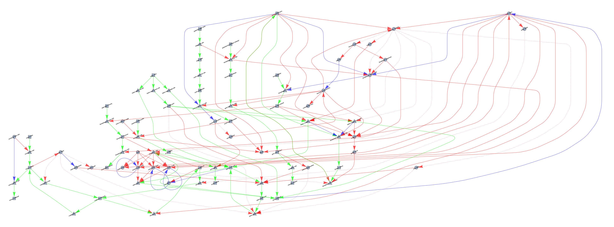
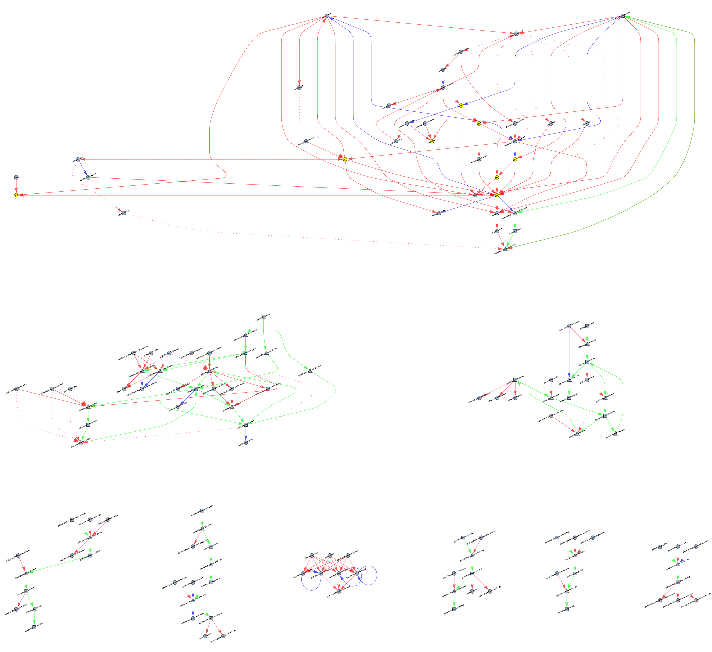
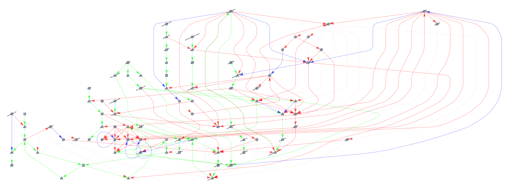
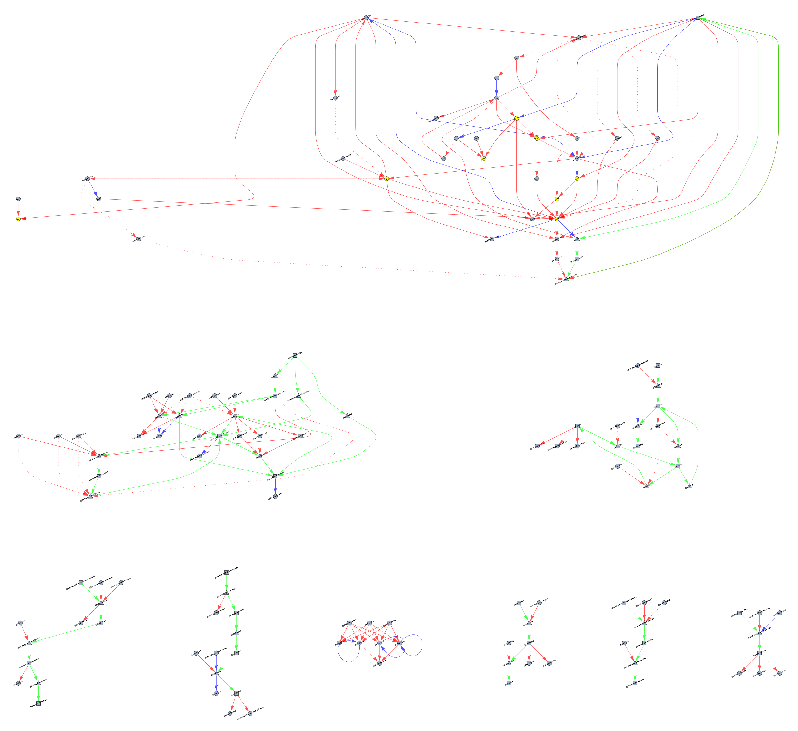

# MAD-4: Model Visualisation

## Changes Since MAD-3

Nothing in the model itself has changed. We have only created a new set graphs
that are more readable, and that come in a few flavors: with abbreviations, with
subgraphs, with abbreviations **and** subgraphs, and with neither.

We centered the node-names over the nodes, and have reduced the font-size and increased
the graph-size to make it readable when zoomed.

Mathematica gives little control over the layout, so while the graph in MAD-2 looked
pretty good, the newer graphs had more clutter and noise. We decided to deal with
the clutter by factoring the graph into subgraphs.

This necessitated _prefixing_ the external/input/exogenous nodes so that these subgraphs
are not connected to the main/base graph. If an exogenous node is in _another_ subgraph,
then there is a double-prefix, so that the 2 subgraphs remain isolated.

We have chosen to take the stock and flow networks and turn most of them into subgraphs,
along with relevant indicators. The only stock and flow network that remains in the
main graph is the network involving threatslayer-users/adoption/abandonment, because
that network has **many** exogenous input-variables and output-variables, making the overall
result **more** cluttered than otherwise. We have also subgraphed the order-book nodes and edges.

The abbreviations are experimental, and are less useful than anticipated. We might not
continue using them. We have a table/legend, that we have not included in this document, because
you can always figure out what means what, by looking at a graph _without_ abbreviations.
We found that decreasing the font-size and centering it on top of a node was much clearer.

## Base Graph

Here is the base graph, with clutter around the nodes and edges having to do with
the order books.

## Subgraphs

Here is a sub-graph version of the above graph. The subgraphs appear are *yellow* nodes
in the base graph, with their corresponding subgraphs below. All internal nodes of a subgraph
are prefixed with `@sgname/nodename`. External base-nodes are `@sgname::nodename`. External
subgraph nodes are `@sgname::@othersgname/nodename`. This is required to prevent interlinking these
graphs.

## Abbreviations

With abbreviations. Not terribly exciting.

## Subgraphs and Abbreviations

Same as previous, but for subgraphs.

## Implications

We could potentially use these subgraphs to break the model down into sub-models that can
be tested independently. But more importantly, people can use them to try to understand
the model in pieces/components, without having to follow a chain of nodes all across the
graph.