# MAD-5: Realistic Strategies

## Changes Since MAD-4

In the previous Model Analysis Documents (MAD-3, and MAD-4), we looked at evolved
strategies based on new fitness-values and new stimuli. Here, we do much the same,
but with larger generations, longer evolution times, explicitly modeled stakeholder-pools,
unbounded token-prices, more granular genomes, gene-pinning, and various bug-fixes and
new features.

## Fitness, Stimuli, Actions

Let's start with fitness and stimuli. We removed the `stim-user-goal-progress` stimulus
because it was constantly getting ignored by the fittest organisms -- it was essentially
noise and we spent evolution-time learning to ignore it. When we removed it, we produced
our up-to-that-point-fittest organisms from the very first generation. Which neatly takes
us into fitness: we now use an up-rounded (i.e. `math.ceil`), power-of-2 logarithm of
the product of `threatslayer-users`, `token-price`, `foundation-pool-tokens`. Initially,
we used `token-price` times `foundation-pool-tokens` as a total-asset-value
fitness-measure. These both produced much better results than a raw revenue-based fitness.
What this basically does is that it promotes more diverse organisms (i.e. organisms that
are fit in different ways), and it only notices organisms that are twice as fit as
most-fit-organism-so-far. Organisms can sacrifice relative-asset-value (i.e. token-price)
for cumulative-asset-value (i.e. foundation-pool-size), and for user-base-size --
or any permutation thereof.

Speaking of stimuli and genes, we have also made our genome more granular with values:
`[-1, -0.66, -0.33, 0, 0.33, 0.66 1]`. This gives the model more nuanced sensitivities.
We have pinned (i.e. frozen) certain genes at zero, namely `stim-contradiction-rate-change-max-stake`
and `stim-contradiction-rate-change-lookup-fee`. These tended to always converge on zero.
Any pinned genes do not get counted as part of the mutation-rate percentage.

We previously had stimuli combine/multiply into action-points which ranged from -100 to 100.
This has been changed to -1 and 1, so that stimuli and actions can be plotted on the same graph
and axis. If having larger points is desired (i.e. to feed into an aggregation for stochastic
selection -- like a deck of cards), one can just multiply by whatever constant factor they like.

We now only use the _absolute_ values of the points-outputs, so we can potentially eliminate all
negative numbers from the genome (which should reduce the search-space).

## Evolution Runtime Features and Improvements

We also added evolution-timings which tell us how many seconds an evolution ran. We control
the runtime by decreasing population-size and generation-count. We optimized performance
further by removing an explicit aggregation `deepcopy`. This was not necessary, since
cadcad already stores copies of every object that is a state-variable. The only issue
is that we cannot access previous aggregation-values using our prev/current-tuples,
but we never really had to do that in practice anyway.

## Stakeholder Pools

The biggest change is that we now model each stakeholder pool explcitly. We model
the vesting-timelines, the vesting-cliffs, even the token-price for each pool. We
also model the rewards-pool and foundation-pool explicitly and put them under the
control of the genetic algorithm. The in-model Interlock can choose to buy and sell
tokens into/from these pools in any way that it wants, but it is obligated to sell
tokens to pay for any expenses that it lacks cash to pay for.

For more realism, we have removed crude parametrizations for moving rewards into
the sell-pool or hold-pool -- all rewards are now moved into the hold-pool, and are
stored in the order-books as having been "bought" for a price of zero. This makes the
dynamic between rewards and trading more endogenous than before.

This changes the overall dynamics and economics.

We had to add some new features to our `Aggregation` class, such as the ability to aggregate
on multiple values (`multi_aggregate` function). This lets us add tokens from each
stakeholder-pool (i.e. advisors, presale-1, founders) into the order-books at their
respective prices -- we previously had only 1 price value for all tokens, and this was not
necessary. Multi-aggregations simply process multiple sets of related context-values.

This in turn lets all of those pools be governed by market-logic of the order-books.


## Simulation Parameters and New Data

We are still running with the worst-case parameters, but have made them _even worse_
than before. We now cap our user-base and half-a-million (similar extensions like Browser WatchDog have
this many users, so not unprecedented) instead of one-hundred-million.
We have updated the valuation to the real-world current 0.035$ valuation.

We have also used production-data to update the page-visit-rate per user per week
(a surprising 231 pages per user), maliciousness-rate, and uniqueness-rate. We have
used the same data to observe weekly user-base-growth, and it hovers at around 2%,
with a high of 8%. This of course changes a lot of the economics, and user-growth.
For starters, it means that our false positive/negative rate has to be much smaller.
At a mere 5%, a user will see false positive/negative twice a day, at 3% once a day,
and at 1% every 2 days. We thus set the range of contradictions to be 0.5% to 5%, with
anything less than 0.5 being effectively zero. This makes the model even more unforgiving
and means that either heursitic-innovation and/or staking have to be prioritized early,
if we want to have non-trivial adoption.

We have also reduced the ratio of free-loaders (i.e. people who will turn off data-sharing
if lookup-fees are applied) to 50%, because 90% produced abysmal results (i.e.
we would lose 90% of the threat-stream and revenue).

## Fun Results

We have run various evolutions with these changes, and -- as is often the case --
they spurred yet more changes. We used to have a fixed price-ceiling of 60$ for
the token. The in-model Interlock realized that it could buy most of the tokens -- after 200 weeks --
and increase both the price and the cumulative assets (foundation-pool). Removing
this artificial ceiling fixed this "hack" because the in-model market started dumping
the token after a large price-spike.

Another fun result was watching the in-model Interlock sell hundreds of millions of tokens
to fill up its cash-reserves, push price down to 0.01 -- a price-floor -- and then buy
all those tokens back, while growing the user-base, which results in a relatively high fitness,
in **spite** of a very small price. Lowering the price-floor by an order of magnitude made this strategy
less tenable (because multiplying by an extremely small price causes 10x smaller fitness).

## Interesting Results

We ran a few evolutions to get a diverse set of optimized organisms. We are going to
look at 3 of them. We will call them: price-destabilizer, price-stabilizer, and crowd-funder.
We will look -- in this order -- at each of these organisms' genomes, the stimulus/action-plots,
the various token-pools and revenue-pool, the token-price, and extension-related metrics like
user-base-size, and so on.

### Genomes

```
Crowd Funder:
  {'stim-contradiction-rate-change-max-stake': 0,
   'stim-anti-user-goal-progress-change-max-stake': 0.33,
   'stim-token-price-delta-change-max-stake': 0,
   'stim-contradiction-rate-change-stake-yield': 0,
   'stim-anti-user-goal-progress-change-stake-yield': 0,
   'stim-token-price-delta-change-stake-yield': 0,
   'stim-contradiction-rate-change-lookup-fee': 0,
   'stim-anti-user-goal-progress-change-lookup-fee': 0,
   'stim-token-price-delta-change-lookup-fee': 0,
   'stim-contradiction-rate-change-user-fee': -0.33,
   'stim-anti-user-goal-progress-change-user-fee': -0.33,
   'stim-token-price-delta-change-user-fee': -1,
   'stim-contradiction-rate-change-buyback-amount': 0,
   'stim-anti-user-goal-progress-change-buyback-amount': 1,
   'stim-token-price-delta-change-buyback-amount': 0,
   'stim-contradiction-rate-change-sell-amount': -0.66,
   'stim-anti-user-goal-progress-change-sell-amount': -0.33,
   'stim-token-price-delta-change-sell-amount': 0,
   'stim-contradiction-rate-change-reward-amount': 0.66,
   'stim-anti-user-goal-progress-change-reward-amount': 0.33,
   'stim-token-price-delta-change-reward-amount': 0,
   'stim-contradiction-rate-change-urgency': 0.33,
   'stim-anti-user-goal-progress-change-urgency': 0,
   'stim-token-price-delta-change-urgency': 0}
```

```
Price Destabilizer:
  {'stim-contradiction-rate-change-max-stake': 0,
   'stim-anti-user-goal-progress-change-max-stake': 0,
   'stim-token-price-delta-change-max-stake': 1,
   'stim-contradiction-rate-change-stake-yield': 0,
   'stim-anti-user-goal-progress-change-stake-yield': 0,
   'stim-token-price-delta-change-stake-yield': -1,
   'stim-contradiction-rate-change-lookup-fee': 0,
   'stim-anti-user-goal-progress-change-lookup-fee': -0.66,
   'stim-token-price-delta-change-lookup-fee': 0,
   'stim-contradiction-rate-change-user-fee': 0.66,
   'stim-anti-user-goal-progress-change-user-fee': 0,
   'stim-token-price-delta-change-user-fee': 0.33,
   'stim-contradiction-rate-change-buyback-amount': 0.66,
   'stim-anti-user-goal-progress-change-buyback-amount': 1,
   'stim-token-price-delta-change-buyback-amount': 1,
   'stim-contradiction-rate-change-sell-amount': -0.33,
   'stim-anti-user-goal-progress-change-sell-amount': -0.66,
   'stim-token-price-delta-change-sell-amount': 0,
   'stim-contradiction-rate-change-reward-amount': -0.33,
   'stim-anti-user-goal-progress-change-reward-amount': 0.33,
   'stim-token-price-delta-change-reward-amount': 0,
   'stim-contradiction-rate-change-urgency': 1,
   'stim-anti-user-goal-progress-change-urgency': -0.66,
   'stim-token-price-delta-change-urgency': 1}
```

```
Price Stabilizer:
  {'stim-contradiction-rate-change-max-stake': 0,
   'stim-anti-user-goal-progress-change-max-stake': 0,
   'stim-token-price-delta-change-max-stake': 0,
   'stim-contradiction-rate-change-stake-yield': 0.33,
   'stim-anti-user-goal-progress-change-stake-yield': 0,
   'stim-token-price-delta-change-stake-yield': 0,
   'stim-contradiction-rate-change-lookup-fee': 0,
   'stim-anti-user-goal-progress-change-lookup-fee': 0,
   'stim-token-price-delta-change-lookup-fee': 0,
   'stim-contradiction-rate-change-user-fee': -0.66,
   'stim-anti-user-goal-progress-change-user-fee': 1,
   'stim-token-price-delta-change-user-fee': 0,
   'stim-contradiction-rate-change-buyback-amount': 0,
   'stim-anti-user-goal-progress-change-buyback-amount': 0.66,
   'stim-token-price-delta-change-buyback-amount': 0,
   'stim-contradiction-rate-change-sell-amount': -0.33,
   'stim-anti-user-goal-progress-change-sell-amount': 0,
   'stim-token-price-delta-change-sell-amount': 0,
   'stim-contradiction-rate-change-reward-amount': 0,
   'stim-anti-user-goal-progress-change-reward-amount': 0,
   'stim-token-price-delta-change-reward-amount': 0,
   'stim-contradiction-rate-change-urgency': 0,
   'stim-anti-user-goal-progress-change-urgency': 0.66,
   'stim-token-price-delta-change-urgency': 0}
```

### Stimuli and Actions

Just a reminder that the actions are interpreted as _absolute_ values, so a -0.5 is equivalent to 0.5.
We are considering making this a universal assumption, as mentioned above.

The simuli and action plots for crowdfunder:

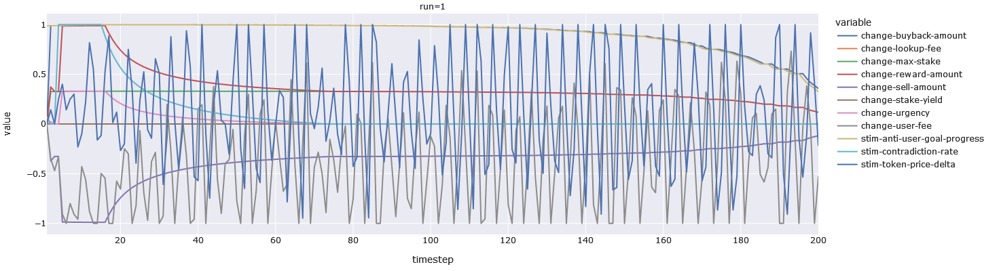


Just the simuli plots for crowdfunder:

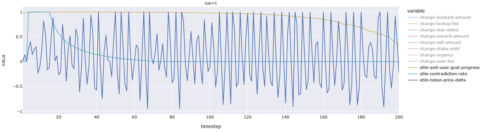


Just the actions plots for crowdfunder:

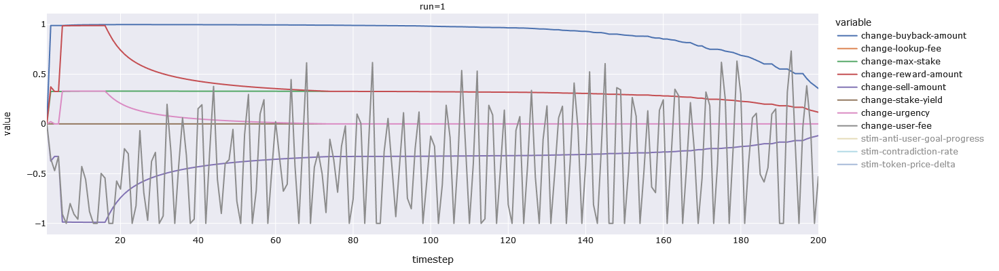


We can see that the crowdfunder changes rewards as a function of contradiction-rate
and distance-from-user-goal, which means that it keeps issuing rewards until it reaches
the assumed maximum (i.e. 0.5M) or the simulation ends. The same holds for the
amount of tokens the in-model interlock chooses to sell. But it buys less-and-less
and it approaches the user-goal, and it allows less-and-less staking as more users
join the network. There is no per-lookup-fee but there is a weekly user-fee which
is modulated by token-price-delta, contradiction-rate, and anti-user-goal -- the latter
two basically suppress the fee, while the token-price-delta amplifies it. This plays a key
role in the fitness of the model.

For context, the user fee can be as high as 3 tokens per week, and as low as 0.


Now we move onto the price destabilizer.


The simuli and action plots for price destabilizer:

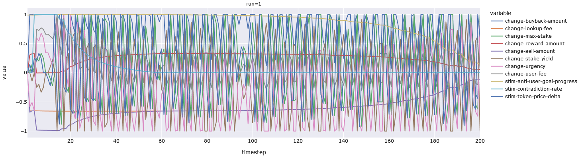


Just the simuli plots for price destabilizer:

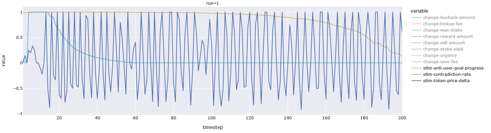

Just the actions plots for price destabilizer:

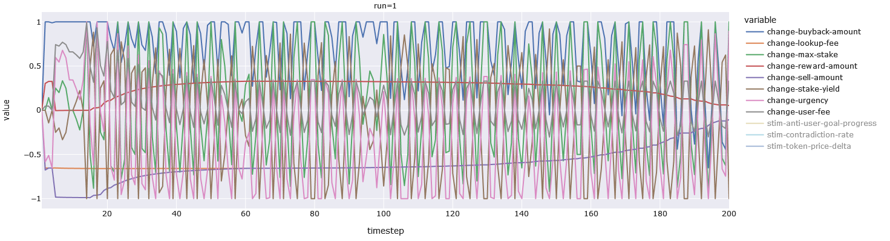

The price destabilizer is a fun one. True to its name it consistently causes price volatility (from run-to-run).
This means that the volatility is endogenous and caused by the genetic configuration, and not by randomness.


And now we move onto the price-stabilizer.


The simuli and action plots for price stabilizer:

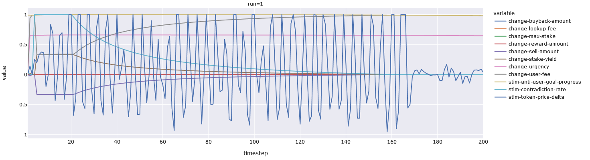

Just the simuli plots for price stabilizer:

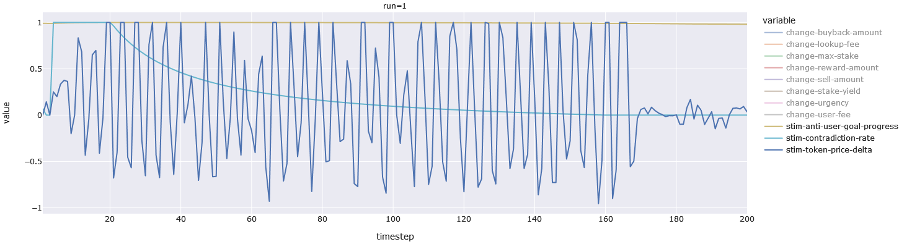


Just the actions plots for price stabilizer:

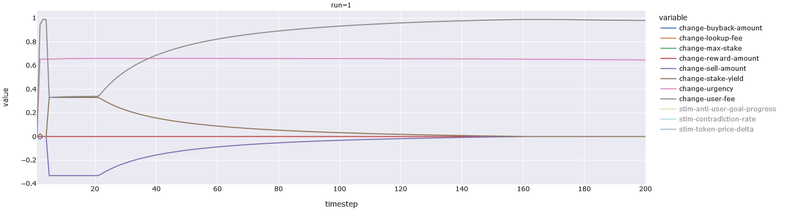

The stabilizer -- as you can see -- is distinguished by being able to consistently reduce the price-volatility
by the last few weeks of the simulation and by being able to spike the price just before that. In some runs
it manages to spike the token-price to 100$ before closing the simulation at 19$ (which is extremely high
considering that the starting value is 0.035$). It does not always end up doing this (the run we examine here
is more representative -- we examine this organism because it is very counter-intuitive and unusual).


### User Growth Effects

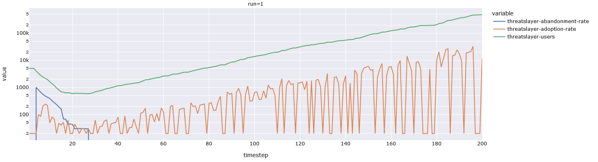

The crowdfunder manages to reach 0.5M consistently.

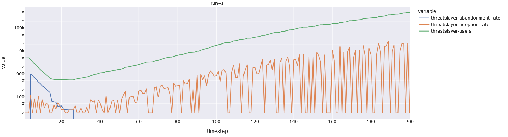

The destabilizer reaches 0.5M consistently, as well.

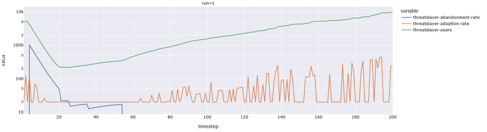

The stabilizer reaches 10k (or less) consistently. We told you it was counter-intuitive.


### Pool and Price Effects


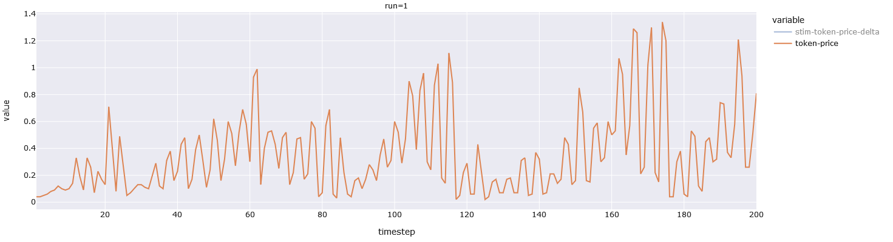

The crowdfunder maintains a consistently oscillating price, but at the expense of the price-peaks.
It has the lowest peaks of any organism.

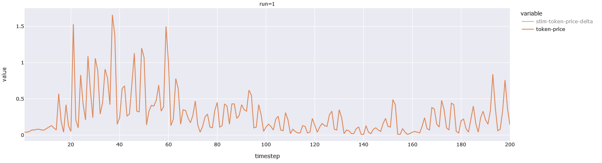

The destabilizer starts with a lot of volatility in the beginning before getting less volatile in
the second half of the simulation. It is notable that the peaks are quite high compared to crowdfunder.

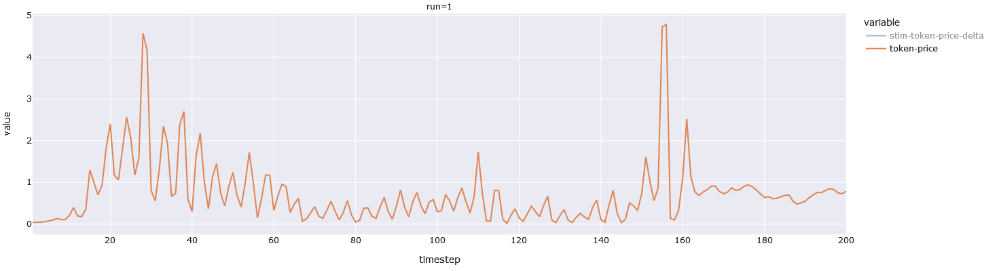

As expected, the stabilizer pushes prices to higher peaks than the other organisms,
and stabilizes them for the last few weeks.


Now we move onto the pool-sizes for each organism. It should be noted that we can freely move tokens
from the foundation-pool into the rewards-pool. What this means is that even if rewards-pool hits zero,
that is fine as long as the foundation-pool is not also zero. These 2 pools are never zero at the same time
(we just did not have time to code the mandatory flow from one pool into the other).

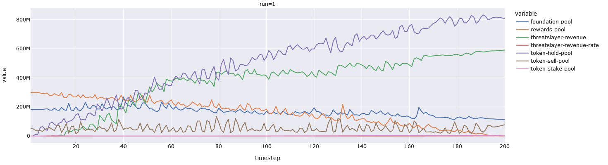

We see that over time the majority of tokens end up in the token-hold-pool. This reflect the pareto-principle.
Essetially, longer-term investors end up acquiring more and more tokens, while short-term investors end up
fighting over fewer and fewer tokens. This drives the price up. You will also notice that the revenue-rate
is zero, but the revenue is rising. This is because the in-model interlock buys and sells tokens. What is
interesting is that this organism does not decide to buy or sell based on token-price but rather on the
other 2 stimuli.

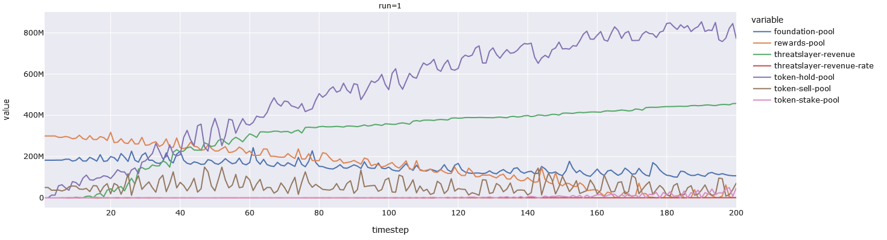

Here we see similar curves, but the revenue is smaller, rewards-pool declines sooner, but the foundation-pool is
the same size. We also see more staking activity in the end. This organism happens to be more fit than crowdfunder because revenue
is not a fitness-measure, but total-asset-value is -- and the token-price is (usually) higher.

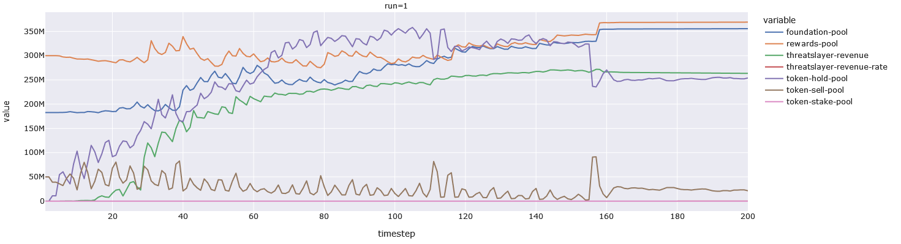

And now we get to the stabilizer, which -- true to form -- manages to get decent results using counterintuitive
tactics. It relies on using selling and buying to drive the value of the token upwards. It is basically manipulating
the arithmetic of investment-pool to sell-pool -- it tries to make one bigger and the other smaller.


And now we get to the hold/unhold-rates which represent buys and sells. The blue and green lines are token **buybacks**.
The orange and red lines and tokens that interlock **sells**. The purple line represents money the in-model Interlock
gets from the market due to token-sales. Yellow lines represent ordinary token-holders selling their tokens, and the pink line
represents ordinary token-holders buying tokens. 


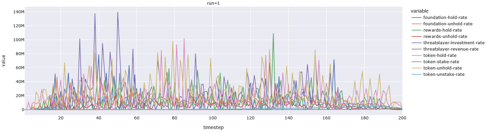

We see that the crowdfunder sells tokens in a way that ends up bringing it a lot of initial cash. It proceeds to to
buy and sell, steadily throughout the simulation often simultaneously. It sells less aggressively than the destabilizer. 

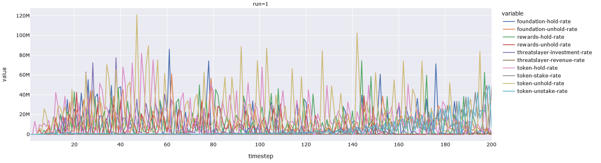

The destabilizer does not really sell tokens to raise cash, in fact it sells tokens in proportion to price-delta,
so it ends up increasing any volatility, resulting in stable and unstable periods (it buys/sells less when the price
is stable).

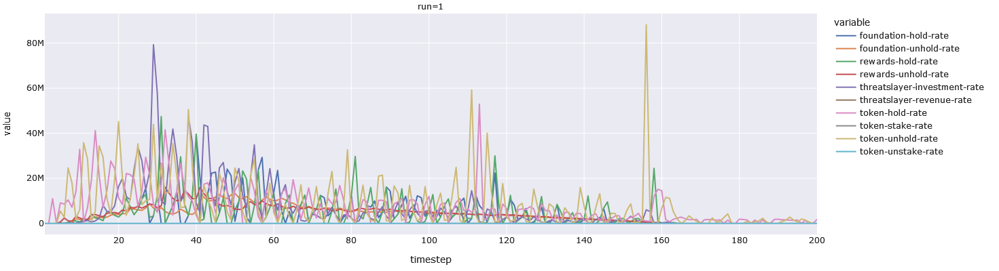

The net-effect of the stabilizer is that it ends up decreasing the "flow-rate" of the entire economy, which results
in stable prices. In some sense the stabilizer is sacrificing its own economic longevity by pumping prices.


## Conclusion

Looking at all of this, we are left a question. Why does the crowdfunder so well? The answer is in the name. It uses
its token and cash reserves to create steady activity in the markets (and keep itself alive financially), while changing
the weekly user-fees in relation to the percentage-price-change. If a price goes up or down by at least 100%, we set the
user-fee to 3 tokens a week. This means that our user-base will have to buy 3 tokens to keep using the product for the next
week (we assume that 50% of them are free-loaders and will not do it). This of course pushes the price higher, because 250k
users buying 3 tokens is a lot of tokens. If the price stagnates, we reduce the user-fee to zero. Which frees those tokens up
for other uses.

One might question whether people would buy more tokens due to an surprise price-driven price-hike. But, we suspect that the
answer is "yes, depending on how it is presented". For example, if we announce a price-hike that will begin next week, it may
motivate people to start hoarding "cheap" tokens _this_ week, which will have a similar upwards-pressure on the token-price,
before any hike is even enacted.

As for the price-stabilizer, it did both stabilize the price and, in many instances, drive it to meteoric heights. Admittedly,
we are unsure if the price-stabilizer is particularly realistic as a strategy. It only has 10k users, for example, and does
not reward them at all -- it even forbids staking. In fact it looks like it creates "bubbles" to drive up the price, and to
induce artificial scarcity on the token (evidenced by how many tokens it has bought-back into the foundation and rewards pools).
That said, this is not so different from how Bitcoin works (it does nothing useful, other than record movement of tokens, while
the exchanges handle the swapping of tokens and currencies).

The price-destabilizer is an interesting strategy, because price-fluctuations are an input/consideration for _every_ action
that it does. We suspect that even finer-grained genomes might make this strategy more viable than the crowd-funder strategy.
The price-destablizer uses staking more aggressively, which is interesting to us. It is more fit than the crowdfunder when
it manages to get a larger foundation-pool (due to more frequent buying and selling) and/or a higher price (for the same
reason).

## Future MADs

The next MAD will have an updated graphical representation of the model (still in progress because we added a bunch of
new nodes and flows).

We have a bunch of other questions we would like to answer.

    * We want to try aggregate flow-rates as fitness values (analogous to GDP).
    * We want to try a fitness "integral" instead of a point-in-time fitness (if sim had ended 2 turns earlier, result can be different).
    * We want to see what happens when the investment-rate is 1000x larger (making it impossible for interlock to influence price in any way, directly or indirectly).
    * We want to use absolute-value genomes, to speed up evolution.
    * We want to try a trading-volume-delta as a _stimulus_ (instead of price-delta).
    * We want to try the fitness-value _itself_ as a stimulus (it is computed within the cadCAD model and is thus accessible).
    * We want to pin 1/2 or 2/3 of the founders-pool (because the current greed-level is unrealistic)
    * We want to try a user-limit of 10k to see if the only viable strategies are the price-stabilizer strategy or if there exist others.
