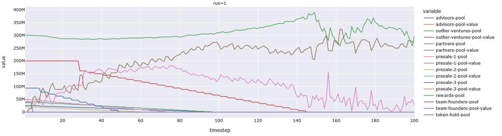

# MAD-6: Stakeholder Pools MiniMAD

## Pools

The previous MAD mentioned that we added stakeholder pools, but there were no plots
that showed what they look like. Below is a plot.

The staircase-pattern shows the periodic vesting of the pool into the token-hold-pool.
All of these get registered in the order-books as having been bought at a price of 0,
and we let the order-books determine how/when they get sold. This is why you see
the token-hold-pool and token-sell-pool grow as the stakholder pools vest.

Also, the long step at the top of the staircase represents the vesting cliff.

This plot was token from a random run, and is not from any of the runs in MAD-5
(which is fine because the vesting schedule is invariant between runs).
