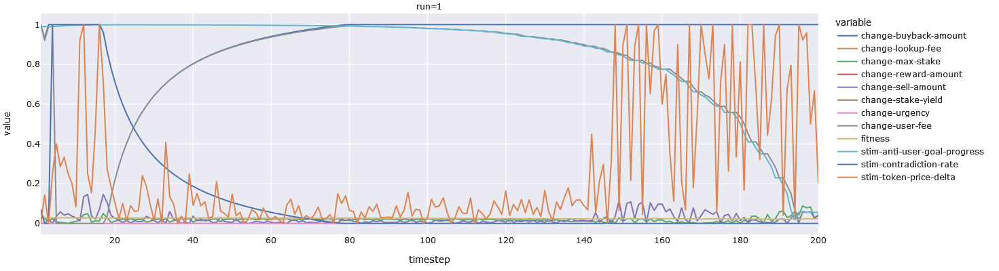

# MAD-7: Inverted Stimuli and Points Multiplication

## Changes Since MAD-5

In the previous Model Analysis Document (MAD-5), we looked at so-called realistic
strategies (in actually they are simply _more_ realistic than previous strategies, but
we digress). In this MAD, we look at the effects of changes to what negative genes
_mean_ -- as metioned in MAD-5, we always take the absolute value of action-points,
and we only really transmit positive stimuli (with the exception of price-delta) --
and the effect of changes to how we compose points (we used to add them, but now we
multiply them -- adding is much more useful when you have negative numbers, whereas
positive numbers end up in a lot of "overkill").

## Inverted Stimuli

Let's start with the inverted stimuli. In pre-MAD-5 times we had 2 stimuli for user-goal
where we opposites: `user-goal-progress` and `anti-user-goal-progress`. They were inverses
of each other, so that `user-goal-progress` as always equivalent to `1 - anti-user-goal-progress`.
Concretely, is the first is 0.85 than the second will be 0.15, and so on. We found that
`user-goal-progress` tended to converge on 0, so we removed it to reduce the search-space from
`(7**(4*7))` to `(7**(3*7))`. The search space of the former is 823,543 **times** larger than the latter.

On top of that we tend to only/usually process absolute values of points, making negative genes redundant.
Removing negative genes would reduce the search space from `(7**(3*7))` to `(4**(3*7))` -- the former being
126,998 **times** larger than the latter. Those are massive reduction in the combinatorics of the
search-space.

However, we still had to realize (through trial and error) that the `user-goal-progress`
was essentially a useless stimulus **before** we could remove it.
In addition, we would have to manually add inverse stimuli for each stimulus to see
if any of them represented a better/more-useful input than the non-inverse variants. Put differently,
if we started with **only** `user-goal-progress`, we would have seen the stimulus not get used very much and
probably removed it outright, instead of trying the inverse of that gene. Given that every stimulus,
**implicitly** carries its inverse -- in the same way that every probability implicitly carries its own
inverse (0.3 is the inverse of 0.7) and in the same way that every set implicitly carries its own complement
(`S` implicitly carries `U - S`, where `U` is the universal-set) -- and given that negative genes
are not as load-bearing as we thought they would be, we realized that we can repurpose the negative
genes as a way to invert a stimulus. For example, if your gene -0.33, and your stimulus is 1, the gene
will compute `abs((1 + -0.33)*-0.33)`. Note that while stimuli previously ranges from -1 to 1, they now
range from 0 to 1, so that the inversion does not "amplify" negative stimuli via the addition.

## Points As Intersections Instead of Unions/Differences

Since negative genes no longer chage the sign of the stimulus upon multiplication, the use of addition
as a way to compose points was no longer as effective (it was arguably sub-optimal from the beginning,
but it was now very close to being broken).

Keep in mind that points always range from 0 to 1. Previously `1*0.66 + 1*-0.33` would give us 0.33.
Flipping the sign on the -0.33 would give us 0.99. And if both genes were set to 1, we would get
`1 + 1 -> 1`. This is what we mean by over-kill. Addition is analogous to set-union, while subtraction
is analogous to set-difference. The union of 2 non-proper-subsets (for a genome split into 1/3rds) tends to
converge on 1 (which is the universal-set if we consider probabilities as sets) very quickly.

All of that to say:  by removing negative genes as multipliers, we have removed set-differences, and set-union
alone is too crude of an instrument. Instead of using a chain of unions/additions and differences, we use
intersection/multiplication. This means that `1*0.66 * 1*0.33` now becomes 0.2178. This prevents over-kill
and makes numbers smaller than 0.33 (our smallest non-zero gene) possible. This of course brings us to
the zero-gene. Anything multiplied by zero is zero (just any set intersecting with an empty-set is an
empty-set). This means that a single zero-gene, for example `'stim-contradiction-rate-change-max-stake': 0,`
will disable the `change-max-stake` action. We can control for this by lower the deletion-rate in
the mutation-routine, but that does not really solve the problem. We want a zero-gene to represent
"ignore this stimulus", and not "disable this action regardless of stimulus" `(0 * 0 = 0)`. To do this
we added a new list-arithmetic-multiplication routine called `mul_pos_ls` which ignores any numbers
in the list that are equal to zero. This gives us the desired effect of ignoring a stimulus.

## Example Organisms

Here is an example-organism that uses the new inverted-stimuli and point-multiplication:

```
{'stim-contradiction-rate-change-max-stake': 0,
   'stim-anti-user-goal-progress-change-max-stake': -0.66,
   'stim-token-price-delta-change-max-stake': -0.33,
   'stim-contradiction-rate-change-stake-yield': 0,
   'stim-anti-user-goal-progress-change-stake-yield': 0,
   'stim-token-price-delta-change-stake-yield': 0,
   'stim-contradiction-rate-change-lookup-fee': 0,
   'stim-anti-user-goal-progress-change-lookup-fee': -1,
   'stim-token-price-delta-change-lookup-fee': 0,
   'stim-contradiction-rate-change-user-fee': -1,
   'stim-anti-user-goal-progress-change-user-fee': 1,
   'stim-token-price-delta-change-user-fee': -0.33,
   'stim-contradiction-rate-change-buyback-amount': -1,
   'stim-anti-user-goal-progress-change-buyback-amount': 0,
   'stim-token-price-delta-change-buyback-amount': 0,
   'stim-contradiction-rate-change-sell-amount': -1,
   'stim-anti-user-goal-progress-change-sell-amount': -0.33,
   'stim-token-price-delta-change-sell-amount': 0.66,
   'stim-contradiction-rate-change-reward-amount': 0,
   'stim-anti-user-goal-progress-change-reward-amount': 0,
   'stim-token-price-delta-change-reward-amount': 0,
   'stim-contradiction-rate-change-urgency': 0,
   'stim-anti-user-goal-progress-change-urgency': 0,
   'stim-token-price-delta-change-urgency': 0},
  0.018867924528301886)
```

As you can see, there are quite a few negative genes. For example it will increase the maximum stake
when token-price is stagnant, and when we approach our user-goal. For example is `anti-user-goal` is 1
we get a max-stake point value of `0.33*0.66`, which is 0.2178. But if it is 0 (when we get 0.5M users),
we get `0.66*0.66` which is 0.435. So it is baised increase the max-stake multiplier when we are _closer_ to
the user-goal rather than when we are further.

Also, we start buying back tokens only as our contradiction-stimulus goes down, and we buy back at our maximum
weekly budget when the contradiction-stimulus is zero (when the false-positive/negative-rate is below 0.5% [half a percent]).
As far as price goes, it wants to sell when volatility is high, but it also wants to increase the max stakable tokens
when volatility is low.

We no longer have to wonder which stimulus needs an inverse counter-part, the evolution will figure that out on its own.
Here is an image if the stimuli and actions for this organism. We can see a dome-shaped curve as a result of the multiplication
and the stimulus inversion. We also smaller action-values, as a result of multiplying numbers less than 1.




## Possible Drawbacks

To get this to work we had to make stimuli range from 0 to 1 instead of -1 to 1. This means that direction
was removed from `token-price-delta` -- it is now a volatility measure, instead of a delta. We have no
way to capture the direction of change, aside from adding an extra stimulus, but then we run into the
problem picking stimuli. A volatility-stimulus and decrease-stimulus could work, but an increase-stimulus and
decrease-stimulus are more difficult to use -- even though they contain the same information. The reason
is that in the latter we can react increases, decreases, non-increases, and non-decreases.
But we cannot react to stagnation. That requires detecting both a non-increase **and** a non-decrease,
which we can only do with a combination of stimulus inversion and a multiplication that **includes** zeroes
(ours ignores them). And even if we could evolve such a thing, how would we determine **which** zeroes (from which stimuli)
to include? In this case we only care about increase and decrease stimuli, but there are 2 other completely unrelated
stimuli.

In the future we may need a way to specify stimuli-sets that should be considered all-or-nothing (so their zeroes would
be considered, but their output-zero would be ignored -- basically a form of nesting). And then we come full circle,
where we ask, how can the evolution do this for us? We anticipate interesting (but time-consuming) answers/solutions
in the future.