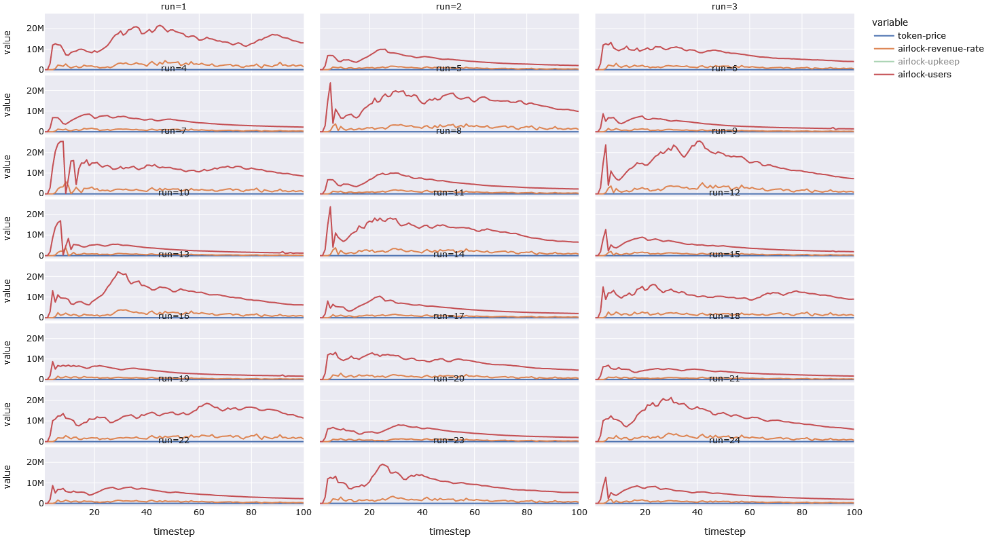
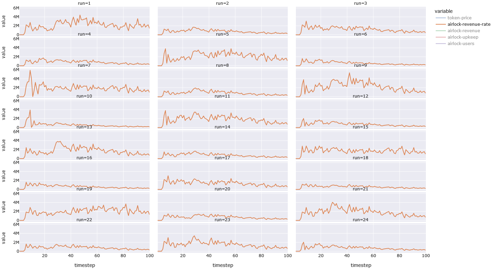

# Adoption and Revenue

We finally have the model is a stable state. We have no divisions by zero. We have
proper order-book-like-things and investor demographics (i.e. swing-trader, position-trader, etc).
Which means that sell pressure is entirely endogenous and driven by profit, while buy
pressure is only partially exogenous (expectation / crypto-hype) and driven by trading
strategy (i.e. swing trader will buy the dip, if they expect the price to go up).

This is the first of a series of shorts the show the current results of the modeling efforts.
Instead  of going back and updating them, we will just post new ones as frequently as possible.

This short is concerned with what the model can tell us about revenue-rate and adoption-rate.
We care about these two things because we need revenue to survive, and we need users to make
the web safer from phishing.

We plot 24 runs (which only vary by parameterization), and we inspect pairs of runs
to see which (if any) of the params might account for the difference.

Here is a plot with adoption-rate and revenue-rate:



We can see that the adoption-rate varies from run to run, with some runs doing better than
others. We know that this is not due to variance in randomness, because each run starts
with the same seed. However, each run is distinguished by parameters. So it is reasonable to
assume that the initial-conditions/constants/invariants encoded by these parameters are the
cause of the changes. We have functions that allow us to ask what parameters differ between
any two runs.

Run 1 has many more users than Run 2. Let's see how the parameters differ.

```
run_diff(1, 2)

 ({'supply-perception': 0}, {'supply-perception': 1})
```

We see that the first run has a more favorable supply-perception (`filling` instead
of `expanding`). This will of course affect the price significantly, which will affect
the adoption-rate (which is calculate as being proportional to reward *times* price).


Lets take a look at Run 2 and Run 4 which look very similar.

```
run_diff(4, 2)
({'max-user-fee': 1}, {'max-user-fee': 2})
```

Well they are basically the same, except Run 4 collects fewer fees
than Run 2 (and Run 1), so that leads to fewer buybacks and a smaller price,
and less adoption.

Lets take a look at Interlock revenues. Run 1 and Run 9 look very similar.
Yet, they must have different parameters. One might even argue that 9 looks
better than 1 from a revenue point of view, in the left half (but declines
gradually in the right half). What are the differences?





```
run_diff(1, 9)
({'minimum-trade-profit': 0.05, 'max-user-fee': 2},
 {'max-user-fee': 1, 'minimum-trade-profit': 0.01})
```

This does seem to check out. Higher minimum trade profit and
higher user fees will push the price and revenues upwards
in the long-run. The question might be why the revenue looks as
good in the first half of the more "pessimistic" model than the
more "optimistic" one. (Keep in mind that this represents 50 weeks or
so revenues).

Run 1 and Run 13 also look very similar, with Run 13 doing a bit
worse in the second half of the time-span.

```
run_diff(1, 13)
({'max-lookup-fee': 9.9e-05}, {'max-lookup-fee': 0})
```

Again, makes sense that the run in which we charge a fee per lookup
will do better in the long run than the one in which we do not. In the
model we designate (for these runs only) that 50% of users are `free-loaders`.
This means that only half of users share data (so that they can avoid the lookup
fees). Even though, half of users are not sharing data in Run 1, Run 1 still
comes out ahead in terms of revenue than Run 13, in which all users share data,
suggesting that the lookup fees are worth more than half of the shared data (of
course those exact numbers might be wrong -- but it does suggest that we should
figure out what the most realistic value for those numbers are).

Anyway, it is late, and past my bed time. Will have more shorts in the future.
